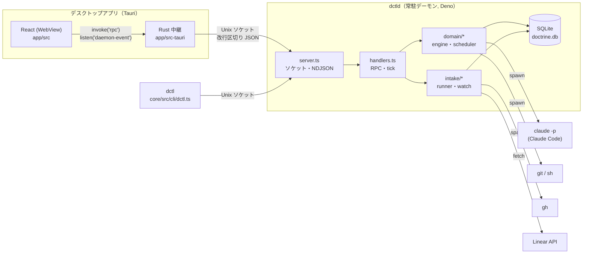
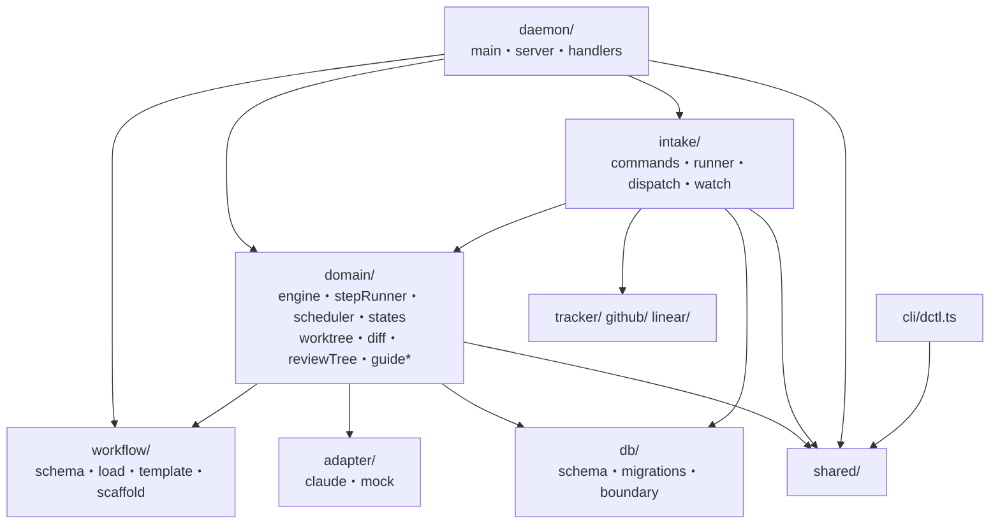
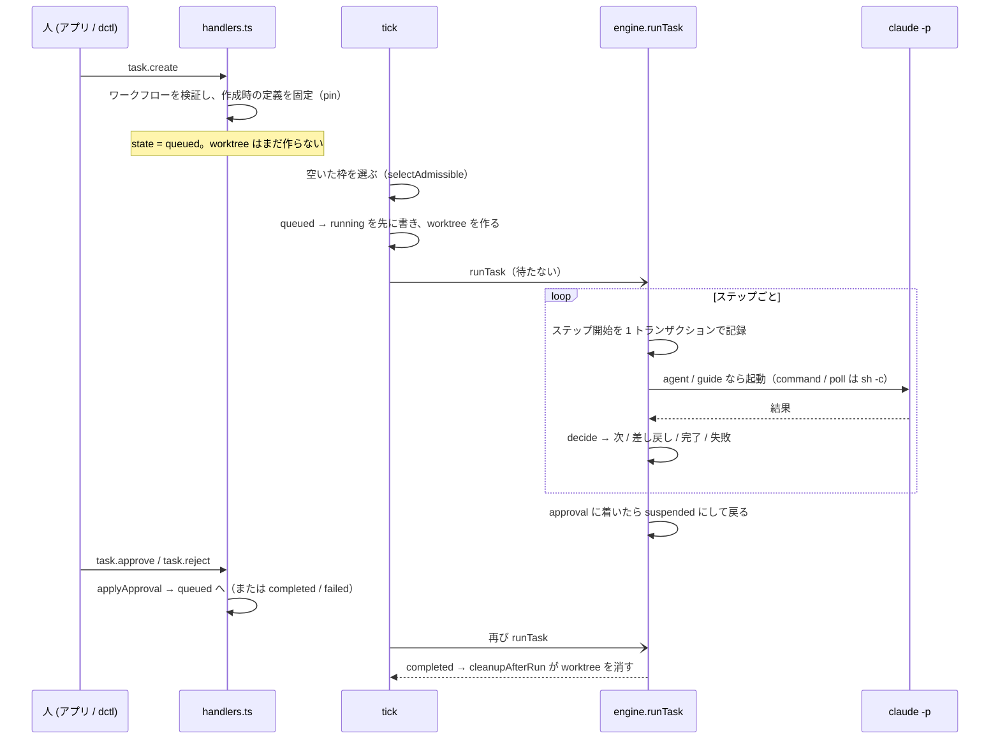

# 1. アーキテクチャ

## 1.1 プロセスの構成

doctrine は 1 台のマシンの上で動く 3 つのプロセスと、それらが呼び出す外部コマンドからなる。

| プロセス | 実体 | 役割 |
| --- | --- | --- |
| **dctld** | [`core/src/daemon/main.ts`](../../core/src/daemon/main.ts) | 唯一の常駐プロセス。状態機械の権威で、DB に書くのはこれだけ。タスクと Intake を進め、Claude Code・git・gh を子プロセスとして起動する。アプリを閉じても動き続ける |
| **dctl** | [`core/src/cli/dctl.ts`](../../core/src/cli/dctl.ts) | 1 コマンドを 1 RPC にして結果の JSON を出す薄い CLI。製品の UI ではなく、デバッグとテストのための面 |
| **アプリ** | [`app/`](../../app) | Tauri v2 のデスクトップアプリ。React が画面、Rust がソケット接続を 1 本保持して RPC を素通しで中継する。dctld が居なければ切り離して起動する |

dctld とクライアントの間の契約は [`shared/protocol.ts`](../../shared/protocol.ts) の型だけで、core と app がこのファイルを直接 import する。
Rust の中継は型を知らず、`method` の中身も見ない（4 章・7 章）。

## 1.2 サブプロジェクト

| ディレクトリ | 言語・実行環境 | 中身 |
| --- | --- | --- |
| `core/` | Deno + TypeScript | デーモン、CLI、ワークフローエンジン、永続化、Intake、トラッカー |
| `shared/` | TypeScript（設定ファイルなし） | core と app の両方が import する契約（RPC の型、Review Guide と PFD と質問のスキーマ）と純関数（hunk id、移動検出） |
| `app/` | React 19 + Vite + Vitest、Rust（Tauri v2） | デスクトップアプリ |
| `pfd/` | Deno | Intake 以前の試作 CLI。どこからも import されておらず、削除予定（2 章） |

詳しいディレクトリの責務は [2 章](02-repository-and-tooling.md) にある。

## 1.3 core の層と依存の向き

- **`daemon/`** は配線である。RPC をメソッド名で振り分け（`handlers.ts:createHandler`）、1 秒ごとの `tick` でスケジューラを回し、エンジンのコールバックをイベントに変えて配る。worktree の作成と後始末もここが持つ
- **`domain/`** がタスクの意味論を持つ。`engine.ts` の冒頭にあるとおり、進行規則（`decide`）は I/O を持たず、ここだけを読めば規則が分かる
- **`intake/`** は Intake の実行系である。エンジン（`engine.ts`）は Intake を知らない。エンジンから見えるのはタスク行の 4 列（`intake_id` など）とテンプレート変数 `{{ issue.* }}` だけ
- **`adapter/`** は Claude Code の起動を `AgentAdapter` の裏に隠す。テストは `adapter/mock.ts` に差し替える
- **`db/`** は Kysely と自前の `node:sqlite` 用 dialect。状態を変える書き込みは `db/boundary.ts:commitStepBoundary` を通す

## 1.4 タスクと Intake — 2 つの実体

doctrine が進めるものは 2 種類ある。

| | タスク | Intake |
| --- | --- | --- |
| 何か | 1 つのワークフロー実行。1 worktree・1 ブランチを持つ | Epic 粒度の Issue 1 件の分解と進行。Issue が終わるまで数日〜数週間生きる |
| 状態 | `tasks.state`（9 値） | `intakes.state`（8 値）＋ `revising` フラグ |
| 遷移表 | `core/src/domain/states.ts:TRANSITIONS` | `core/src/domain/intakeStates.ts:INTAKE_TRANSITIONS` |
| エージェント実行の記録 | `step_runs` | `intake_runs` |
| 実行枠 | 全体枠とプロジェクト枠 | 全体枠だけ（実行中の `intake_runs` 1 行につき 1） |
| 進める仕組み | `tick`（1 秒）→ `runTask` | `tick`（1 秒）→ `runIntakeRun`、見張り（120 秒）→ sub-issue 同期・投入 |

Intake は承認された PFD のプロセスごとに**普通のタスク**を作る（`core/src/intake/dispatch.ts`）。
作られたタスクは他のタスクと同じエンジン・同じ実行枠で進む。Intake をワークフローとして実装しなかった理由は、
`suspended` のまま実行枠を握り続けてしまうためである（[Intake の PRD](../prd/intake.md) 5.2）。

## 1.5 1 つのタスクが流れる道筋

詳細は [3 章](03-workflow-engine.md)。

## 1.6 全体を貫く設計の約束

以下はコードのあちこちで前提にされている約束で、変更するときに崩してはいけない。

1. **DB に書くのは dctld 1 つだけ。** 起動時に `main.ts:assertSocketNotLive` が生きているデーモンを検出して二重起動を拒否する。
   アプリの中継も、起こした dctld の子プロセスを保持して二重に起こさない
2. **状態はステップ境界ごとに 1 トランザクションで書く。** タスク行・`step_runs`・会話の記録・出力を `commitStepBoundary` が同時に書く。
   デーモンが落ちて失うのは進行中の 1 ステップ分だけで、その代わり中断された `command` ステップは頭から再実行される
3. **読んでから書く経路は `requireState` で比較付き更新にする。** 読んだ後に `task.cancel` などが状態を変えていれば何も書かず
   `StateConflictError` になる。Intake も `updateIntake(..., { requireState })` で同じ作法を取る
4. **実行枠はカウンタで持たず、毎回状態から数える**（`scheduler.ts:currentUsage`）
5. **タスクが従うワークフローは作成時に固定する。** `tasks.workflow_yaml` と `workflow_setup` に作成時の中身を保存し、以後はディスクを読まない
6. **判断は人に残す。** approval の承認・却下、Intake の承認と人のプロセスの完了記録は RPC だけが経路で、エージェントの道具にも dctl にも無い
7. **失敗した実行の証拠を消さない。** `failed` / `canceled` のタスクの worktree は残す。`completed` でも未コミットの変更があれば消さない
8. **tick・見張り・後始末は例外を外へ投げない。** 1 件の失敗で他のタスクやデーモン全体を巻き込まないため、失敗は行を `failed` にし、警告として届ける
9. **doctrine はワークフローの成果物の中身を理解しない。** `.doctrine-out/` のファイルは規約上の置き場で、コアがするのは
   `.git/info/exclude` への追記と、`review.files` と `guide.json` の読み出しだけ
