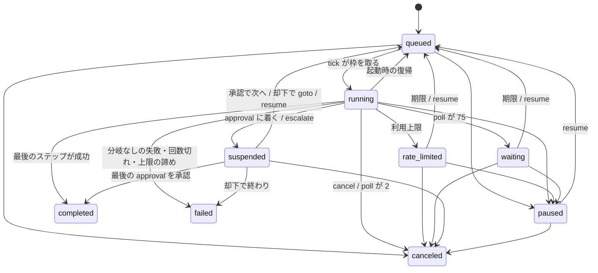
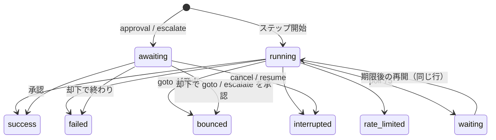

# 3. ワークフローとタスク実行エンジン

タスクがワークフローに沿って進む仕組みを扱う。対象は `core/src/workflow/`、`core/src/domain/` のうちタスクに関わるもの、
`core/src/adapter/`、それらを呼ぶ `core/src/daemon/handlers.ts` の `tick`。

## 3.1 ファイルの分担

| ファイル | 責務 |
| --- | --- |
| `workflow/schema.ts` | YAML → `Workflow` の検証（zod）、日本語のエラー、ステップ 5 種の型、`branchOf`、非冪等コマンドの警告 |
| `workflow/template.ts` | `{{ ... }}` の展開 |
| `workflow/project.ts` | `project.yaml` の検証、`setup` の自動挿入（`withSetupStep`）、画面からの保存 |
| `workflow/load.ts` | ディスクからの読み込み、作成時の固定（`pinOf`）、タスクが従う定義の解決（`taskWorkflow`） |
| `workflow/scaffold.ts` | `dctl project-add` が作る `.doctrine/` の雛形 |
| `workflow/save.ts` | 画面からのステップ編集を、コメントを残したまま YAML に当てる |
| `domain/engine.ts` | `decide`（純粋な進行規則）、`runTask`（1 タスクを次に止まる地点まで進める）、`applyApproval` |
| `domain/stepRunner.ts` | ステップ 1 回の実行。ログの書き出し、`StepOutcome` を返す |
| `domain/states.ts` | タスク状態の遷移表と、枠を握るかの判定 |
| `domain/scheduler.ts` | 枠の使用数、受付順、期限の来た待ちの解放 |
| `domain/rateLimit.ts` / `domain/poll.ts` | 利用上限の判定、poll の終了コードの解釈 |
| `domain/recovery.ts` | 起動時のクラッシュ復帰 |
| `domain/cancelTask.ts` | 中止の共通経路 |
| `domain/worktree.ts` | worktree の作成・削除・孤児検出、ブランチ名 |
| `domain/systemPrompt.ts` | agent / guide に必ず付けるシステムプロンプト |
| `adapter/claude.ts` | `claude -p` の起動引数と出力の解釈 |

エンジン（`runTask`）は worktree を作らないし消さない。それは `handlers.ts` の `tick` と `cleanupAfterRun` の仕事である。

## 3.2 ワークフロー定義

### スキーマ

トップレベルは `{ name, steps }`。すべての枝が `.strict()` で、種類に無い項目（例: command の `session`、guide の `prompt`）は弾かれる。

| type | 必須 | 任意 | 失敗時の分岐 |
| --- | --- | --- | --- |
| `command` | `run` | — | `onFailure` |
| `agent` | `prompt` | `session`、`permissionMode`、`model`、`allowedTools` | `onFailure` |
| `approval` | `title` | `review: { files }` | `onReject` |
| `guide` | `session` | `permissionMode`、`model`、`allowedTools`（`prompt` は書けない） | `onFailure`（省略時は既定の分岐） |
| `poll` | `run` | `interval`（既定 `1m`、30 秒未満は拒否） | `onFailure` |

- ステップ id は `/^[a-zA-Z0-9_-]+$/`。重複と、予約語 `setup`（`RESERVED_STEP_IDS`）は拒否する
- 分岐 `Branch = { goto, maxAttempts, feed?, onExhausted?: "fail" | "suspend" }`。`goto` は前方・後方・自分自身のどこを指してもよいが、実在しなければ拒否する。approval の `onReject` に `onExhausted: suspend` は書けない（却下は既に人の判断なので）
- `branchOf(step)` が分岐を 1 つに決める。approval は `onReject`、guide で `onFailure` を省略したら `{ goto: 自分, maxAttempts: 3, feed: "{{ steps.<自分>.last_stderr }}" }`、それ以外は `onFailure`
- `review.files` は worktree からの相対パスだけを許す（空文字・`/` 始まり・`~` 始まり・`..` を含むものを拒否）。実行時にも `domain/reviewFiles.ts:readReviewFiles` が realpath で worktree の配下かを確かめ直す
- **非冪等コマンドの警告**（`NON_IDEMPOTENT`）: command と poll の `run` に `gh pr create` / `gh pr comment` / `gh release create` / `git push` / `npm publish` / `pnpm publish` があれば、エラーではなく警告に積む。警告が外へ出るのは `task.create` の応答と `ctx.warnings` だけ
- エラーメッセージは `formatZodIssues` が `path: 日本語` の形にし、`WorkflowValidationError.issues` に配列で持つ
- テンプレートの変数は**パース時に検証しない**。未知の変数は実行時の `expand` で初めて `TemplateError` になる

### テンプレート変数（`template.ts`）

| 変数 | 値 |
| --- | --- |
| `task.id` / `task.title` / `task.prompt` / `task.branch` | タスク行 |
| `issue.url` / `issue.parent_url` / `issue.closes` | Intake 由来のタスクの sub-issue、親 Issue、`Closes <sub-issue>`。そうでなければ空文字 |
| `worktree.path` / `project.path` | パス |
| `steps.<id>.last_stdout` / `last_stderr` / `exitCode` | そのステップの**最新の**実行の出力 |

- 置換結果は再走査しない。エージェントの出力に `{{ }}` が含まれていても展開されない
- 出力は `step_outputs` に末尾 8192 バイト（`OUTPUT_TAIL_BYTES`）だけ残る。agent の `last_stdout` は最終応答テキスト、`last_stderr` は stderr の末尾、approval の `last_stdout` は却下コメント、guide の検証失敗時の `last_stderr` は検証の理由
- 未実行のステップを参照すると `TemplateError`

### `setup` の自動挿入と作成時の固定

- `project.yaml` の `setup` は特別な機構ではない。`withSetupStep` が `{ id: "setup", type: "command", run }` を先頭に足すだけ
- `task.create` のとき `pinOf` がワークフローの YAML とその時点の `setup` を `tasks.workflow_yaml` / `workflow_setup` に保存する
- 以後、tick・承認・復帰・読み取りはすべて `taskWorkflow` を通り、保存した中身から定義を作る。**作成後にディスクの YAML や setup を変えても、既存のタスクには効かない**。`workflow_yaml` が NULL の行はマイグレーション 0011 より前のタスクで、ディスクを読む

## 3.3 状態

### タスクの状態（`db/schema.ts:TaskState`）

| 状態 | 意味 | 全体枠 | プロジェクト枠 |
| --- | --- | --- | --- |
| `queued` | 枠待ち | × | × |
| `running` | ステップを実行中 | ○ | ○ |
| `suspended` | approval で人を待っている、または `onExhausted: suspend` で人の判断を待っている | × | ○ |
| `paused` | 人が止めた | × | ○ |
| `rate_limited` | 利用上限の明けを待っている（`rate_limited_until`） | × | ○ |
| `waiting` | poll が「まだ」と答え、次に確かめる時刻を待っている（`waiting_until`） | × | ○ |
| `completed` / `failed` / `canceled` | 終端 | × | × |

`suspended` などが全体枠は返しつつプロジェクト枠を握るので、`maxConcurrent: 1` のプロジェクトでは承認待ちのタスクが後続を止める。



遷移は書き込みの前に `states.ts:assertTransition` で確かめる。遷移表には `queued → failed` の辺もあるが、今のコードでこの辺を書く箇所は無い
（tick が遅い処理の前に `running` を書くので、ワークフローが読めないなどの失敗は `running → failed` を通る）。

### ステップ実行（`step_runs`）の状態

| status | 意味 |
| --- | --- |
| `running` | 実行中 |
| `awaiting` | approval（または escalate）で人を待っている。1 行 = レビュー 1 回 |
| `success` | 成功。権限で拒否された操作があっても成功は成功 |
| `failed` | 分岐しない失敗（分岐なし・回数切れ・上限の諦め）、または却下で終わった |
| `bounced` | 失敗・却下したが goto が効いて前へ戻った。`goto_step_id` が入る（DB の CHECK で `bounced` のときだけ非 NULL） |
| `interrupted` | 外から閉じられた（pause / cancel と競合した、poll が 2 を返した、suspended から cancel / resume した、起動時の復帰） |
| `rate_limited` | 利用上限で打ち切られた。同じ attempt で再開される |
| `waiting` | poll の「まだ」。再開時に同じ行を `running` に戻して使い直す |



## 3.4 tick — タスクを走らせ始めるまで

`core/src/daemon/main.ts` が `setInterval(tickCycle, 1000)` で `handlers.ts:tick` を回す。`tick` は `WeakSet` による再入ガードを持ち、
前の周が終わっていなければ何もせず返る。`tickOnce` の順序は次のとおり。

1. `releaseDueRateLimited` / `releaseDueIntakeRateLimited` / `releaseDueWaiting` — 期限の来た待ちを `queued` に戻し、`task.stateChanged` を配る
2. `hasActiveRateLimit` が真なら**ここで戻る**。利用上限はアカウント全体に掛かるので、待っているものが 1 つでもあれば新しいタスクも Intake も始めない（走っているものは止めない）
3. `startIntakeRuns` — Intake のエージェント実行を先に全体枠へ入れる
4. `selectAdmissible(db, globalLimit)` が返すタスクごとに:
   1. `commitStepBoundary({ requireState: "queued", taskPatch: { state: "running", resumed: 0 } })` で**遅い処理の前に枠を押さえる**。読んだ後に cancel されていれば `StateConflictError` で見送る
   2. `ctx.workflowOf(task, project)` で固定済みの定義を得る
   3. `task.worktree_path` が無ければ `createWorktree`。Intake 由来のタスクは `git fetch origin <base>` をしてから `origin/<base>` を起点にする（上流の PR のマージを確実に含めるため）。それ以外は local の baseBranch
   4. ここまでで例外が出たら `failTaskInTick` で `failed` にする。`queued` に戻すと毎周リトライして他を巻き込むため、一時的な失敗でも恒久的に失敗させる
   5. `void runTask(...)` を**待たずに**起動し、完了後に `cleanupAfterRun`、例外なら `failTaskInTick`

受付順（`queuedInAdmissionOrder`）は `resumed desc` → `priority asc`（既定 2）→ `created_at` → `id`。
`resumed = 1` は承認・却下・resume・期限の解放・起動時の復帰で立つので、再開するタスクが新しいタスクより先に枠を取る。
プロジェクト枠が埋まっているタスクは飛ばし、後ろのタスクを見続ける。

## 3.5 runTask — 1 ステップの進め方

`engine.ts:runTask` は、`running` のタスクを「人を待つ地点（approval）」「終端」「待ち（rate_limited / waiting）」のどれかまで進める。

```
stepId = task.current_step_id ?? 先頭のステップ
loop:
  task を読み直す。running でなければ return（cancel / pause が先に書いた）
  step が approval なら 3.7 へ → return
  attempt を決める（3.6）
  ステップ開始を 1 トランザクションで書く（requireState: running）
    current_step_id、attempt_counts、pending_feed = null、会話の記録、step_run(running)
  stepRunner で実行する
  agent / guide なら利用上限の判定（3.9）、poll なら終了コードの判定（3.10）
  decide で次を決める
  ステップ終了を 1 トランザクションで書く（status は goto が効いたなら bounced）
  次のステップ / goto（feed を展開して持ち越す）/ completed / failed / suspended へ
```

どのコミットでも `StateConflictError` になったら（pause や cancel が先に状態を書いた）、走り終えた行を `interrupted` で閉じ、
状態は何も書かずに戻る。エンジンが外からの操作を上書きすることは無い。

### stepRunner

- **command / poll**（`runCommandStep`）: `expand(step.run)` を `sh -c` で worktree の中で実行する。終了コード 0 で `success`、それ以外で `failed`（シグナルで死んだら終了コードは null）
- **agent**（`runAgentStep`）: プロンプトは **feed があれば feed だけ**、無ければ `expand(step.prompt)`。feed は goto の時点で展開済みなので再展開しない。アダプタの `start` か `resume` を呼ぶ
- **guide**（`runGuideStep`）: [5 章](05-review-guide.md)
- ログは `<stateRoot>/logs/<taskId>/<stepId>.<attempt>.log` に追記で書く（同じ attempt で再開すると同じファイルに続く）。ログを書けなくても実行は続ける

### decide（`engine.ts:decide`）

| 結果 | 決定 |
| --- | --- |
| 成功 | 次のステップ。無ければ `complete` |
| 失敗・分岐なし | `fail` |
| 失敗・`attempts >= maxAttempts` | `onExhausted: suspend` なら `escalate`、そうでなければ `fail` |
| 失敗・それ以外 | `goto`（feed 付き） |
| approval に着いた | `suspend` |

`attempts` は**失敗したステップ自身の回数**である。`maxAttempts: 3` の `verify` は 1 回目・2 回目の失敗で goto し、3 回目の失敗で止まる。

## 3.6 差し戻しと試行回数

- 回数は `tasks.attempt_counts`（`{ [stepId]: n }` の JSON）に持ち、ステップを**始めるとき**に +1 する。approval も suspended に入るときに +1 する
- 例外が 2 つある。直前の同じステップの行が `rate_limited`、または poll で直前が `waiting` のときは回数を進めない。どちらもワークフロー上の新しい試行ではないからで、DB の行から導くのでデーモンの再起動をまたいでも同じになる
- goto が効いた実行は `bounced` + `goto_step_id`、回数を使い切った最後の失敗だけが `failed` として残る
- `feed` は goto の時点で `expand` され、ローカル変数で次のステップへ渡り、ステップ開始のコミットで `pending_feed = null` になる（**一度しか使わない**）。approval をまたぐ場合は `tasks.pending_feed` に保存する

## 3.7 approval と escalate

### approval に着いたとき

1. worktree があれば `captureTree` で未コミット・未追跡を含むツリーを取る（失敗しても警告だけで続ける）
2. `requireState: running` で `suspended` にし、`awaiting` の行を 1 つ立てる（`review_tree` を記録）
3. `retainTree` で `refs/doctrine/reviews/<taskId>/<stepRunId>` を張り、ツリーを `git gc` から守る（[5 章](05-review-guide.md)）

`suspended` のタスクには開いている `awaiting` 行がちょうど 1 つある。これが崩れると `applyApproval` は例外を投げる。

### 人の判断（`engine.ts:applyApproval`）

| 操作 | 結果 |
| --- | --- |
| 承認 | 行を `success` で閉じ、次のステップがあれば `queued`（`resumed: 1`）、無ければ `completed` |
| 却下・goto あり | 行を `bounced` で閉じ、`queued` にして goto 先へ。`{{ steps.<approval>.last_stdout }}` が却下コメントになるよう差し込んでから feed を展開し `pending_feed` に保存 |
| 却下・分岐なし / 回数切れ | 行もタスクも `failed` |

却下にはコメントが必須である（`task.reject` の `comment`）。コメントが無いとエージェントが次にどう動けばよいか分からないため。
最後のステップが approval のワークフローでは承認が `completed` への唯一の入口になるので、`task.approve` のハンドラが自分で `cleanupAfterRun` を呼ぶ。

### escalate（`onExhausted: suspend`）

分岐先へ戻しても直らないまま回数を使い切ったとき、失敗させずに人を待つ仕組みである。
失敗した行を `failed` で閉じ、同じステップ・同じ attempt で `awaiting` 行を立てて `suspended` にする。
`applyApproval` はステップが approval でなければ `applyEscalation` に回す。

- 承認: 失敗したステップの回数を 0 に戻し、`goto` 先から feed 付きでやり直す
- 却下: `failed`

`task.context` の `escalation` 欄はこの状態のときだけ入り、画面はそれを見て「上限に達したので判断してください」という面を出す。

## 3.8 会話（session）と `--resume`

- 会話は**役割（role）単位**で `task_sessions(task_id, role, session_id)` に持つ。agent の role は `step.session ?? "default"`、guide は `step.session`（必須）
- その role の会話が既にあれば `adapter.resume`、無ければ UUID を採番して `adapter.start(prompt, { sessionId })`（`--session-id` で doctrine が id を決める）
- 会話の記録はステップ開始のコミットで**起動前に**書く。command ステップは書かないので、`setup` などが「会話がある」扱いになることは無い
- resume するかどうかは「同じステップのやり直しか」ではなく「その role の会話が既にあるか」だけで決まる。別のステップでも同じ role なら同じ会話が続く
- `tasks.claude_session_id` は古い列で、タスクのコードは使っていない

## 3.9 利用上限（rate limit）での待機

判定は agent と guide にだけ掛かる（`rateLimit.ts:classifyRateLimit` と `engine.ts:decideRateLimit`）。

1. 実行が失敗していなければ対象外
2. 根拠はその実行中に届いた `rate_limit_event`（窓ごとの最新）。1 つも無ければ、実行開始以降に記録された `rate_limit_samples` を使う
3. 利用率が 1 以上で、`resetsAt` が未来の窓のうち最も遅いものを採る
4. 明けるまで 6 時間（`MAX_WAIT_MS`）を超えるなら諦める。同じステップで連続 5 回（`MAX_CONSECUTIVE_RATE_LIMITS`）当たっても諦める
5. それ以外は待つ。待つ時刻は `max(resetsAt, now + 60秒)`

待つとき: タスクを `rate_limited`、行を `rate_limited` にし、feed があれば `pending_feed` に書き戻す（ここだけが feed を書き戻す経路）。
その role の**最初の**呼び出しで当たった場合は会話の記録を消し、再開時に新しい会話で始め直す（会話が作られたか分からないため）。
期限が来ると `releaseDueRateLimited` が `queued` に戻し、`runTask` は回数を進めずに同じ会話を resume する。

諦めるとき: 行を `failed` で閉じ、`decide` を通さずにタスクを `failed` にする（`onFailure` があっても分岐しない）。

待っている間は全体枠を返し、プロジェクト枠は握る。前述のとおり、上限待ちが 1 件でもある間は tick が新規の受付を止める。

## 3.10 poll と waiting

poll ステップは `sh -c` で `run` を実行し、終了コードで次を決める（`poll.ts:pollVerdict`）。

| 終了コード | 意味 | 結果 |
| --- | --- | --- |
| `0` | 終わった | 成功として次へ |
| `75`（`POLL_WAIT`） | まだ | タスクを `waiting`、`waiting_until = now + interval` |
| `2`（`POLL_ABANDON`） | 見込みが無い | 行を `interrupted`、タスクを `canceled` |
| それ以外 | 失敗 | `onFailure` へ |

`waiting` の期限が来ると `releaseDueWaiting` が `queued` に戻し、`runTask` は**同じ行**を `running` に戻して使う（1 回の待ちの周に 1 行）。
doctrine 自身のワークフローの `wait-merge` はこれで PR のマージを待ち、conflict なら 1 を返して `sync` へ戻す。

## 3.11 中止・一時停止・再開

| 操作 | 受ける状態 | すること |
| --- | --- | --- |
| `task.pause` | queued / running / rate_limited / waiting | 子プロセスを SIGTERM し `paused` |
| `task.resume` | paused / suspended / rate_limited / waiting | `queued`（`resumed: 1`）。期限の列を消し、開いている `awaiting` 行を `interrupted` で閉じる |
| `task.cancel` | 終端以外 | SIGTERM し `canceled`。`awaiting` 行を閉じる。worktree は残す |

走っている `runTask` を止める手段は無く、止めるのは DB の状態である。`runTask` は毎周の頭で状態を読み直し、
コミットはすべて `requireState: running` なので、pause や cancel の後に書こうとすると `StateConflictError` になって行を `interrupted` で閉じる。
SIGTERM で殺された実行が失敗として返ってきても、`bounced` や `failed` とは記録しない。

pause から resume すると `current_step_id` は進んでいないので、同じステップを頭からやり直す（agent なら同じ会話を resume）。

## 3.12 クラッシュ復帰（`recovery.ts:recoverOnStartup`）

起動時に `running` のタスクを 1 件ずつ処理する（1 件の失敗で残りを止めない）。

1. `killStaleChild(task, probe, "SIGKILL")` — `child_pid` と `child_started_at` の両方が一致したときだけ殺す（`ps -o lstart=` を `LC_ALL=C TZ=UTC` で読んで比べる）。pid が再利用されていれば殺さない。pid が 0 以下なら `kill` に渡さない
2. `running → queued`（`resumed: 1`）にし、最後の `running` 行を `interrupted` で閉じる
3. 失敗したら `failed` にする

再開の仕方は、再び枠を取った後の `runTask` が決める。agent / guide は会話があれば `--resume`、command / poll は頭から `sh -c` になる。
このため **command ステップは 2 回実行されても安全でなければならない**（README 3 章）。
どちらの場合も直前の行は `interrupted` なので回数は +1 され、feed で入っていたステップは feed を失って `step.prompt` で再開する。

`rate_limited` / `waiting` / `suspended` / `paused` は期限や状態が DB にあるので、復帰処理の対象にならない。

## 3.13 worktree

- **置き場**: `<stateRoot>/worktrees/<basename(projectPath)>/<taskId>`（`worktreePathFor`）。リポジトリの外に置く
- **ブランチ**: `doctrine/<taskId>-<slug>`（`branchNameFor`）。slug はタイトルを NFKC 正規化して英数字以外を `-` にし、40 コードポイントで切ったもの
- **作成**: 枠を取ったときに `git worktree add -b <branch> <path> <base>`。続けて `ensureDoctrineOutExcluded` が `.doctrine-out/` を `.git/info/exclude` に追記する。これで中間成果物が `git status`（削除拒否の判定）にも diff にも混ざらない
- **削除**: `completed` のときだけ `cleanupAfterRun` が `force: false` で消す。未コミットの変更があれば拒否し、警告と `task.cleanedUp { outcome: "refused" }` を出す。ブランチは残す
- `failed` / `canceled` は残す。`worktree.remove`（`dctl gc`）で手で消し、そのときレビュー参照も一緒に消す。終わっていないタスクの worktree は `force` でも消せない
- 起動時に `findOrphans` が DB に無い worktree を警告する（自動では消さない）

## 3.14 Claude Code アダプタ

`adapter/types.ts:AgentAdapter` は `start(prompt, opts)` と `resume(sessionId, prompt, opts)` の 2 つで、
どちらも `AgentRun { sessionId, pid, startedAt, events, result, kill }` を返す。本番は `adapter/claude.ts:createClaudeAdapter`。

```
start:  claude -p <prompt> --output-format stream-json --verbose --session-id <uuid>
          [--permission-mode <m>] --permission-prompts none [--model <m>]
          [--append-system-prompt <text>] [--json-schema <JSON>] [--allowedTools <p1> <p2> ...]
resume: claude -p --resume <sessionId> <prompt> --output-format stream-json --verbose ...（以下同じ）
```

- `--allowedTools` は可変長なので必ず最後に置く。パターン 1 つを argv 1 要素にする
- stdout は `ndjson.ts:readNdjson`（行長無制限、マルチバイト境界を保持、壊れた行は飛ばす）→ `normalize` でイベントにする。thinking は捨てる
- stderr は末尾 4096 文字だけを残す（失敗時の `last_stderr` になる）
- result 行が無ければ失敗。`structured_output` がオブジェクトなら構造化出力として返す（guide と Intake が使う）

### 権限で拒否された操作

`--permission-prompts none` の下では、権限で拒否されてもプロセスは正常終了し、`is_error: false` になる。
そのためステップ実行は `success` のままで、拒否の中身は `step_runs.permission_denials` に `{ total, denials }` として残す
（先頭 20 件、入力のトップレベルの文字列は各 2000 字まで）。

### 組み込みのシステムプロンプト

`systemPrompt.ts:BUILTIN_APPEND_SYSTEM_PROMPT` を agent と guide の両方に `--append-system-prompt` で付ける。
内容は「Bash は 1 回 1 コマンドにし、`;` `&&` `|` などで繋がない」「`git -C` を使わない」の 2 つ。
`allowedTools` の許可は先頭一致なので、繋いだ形や `git -C` 始まりは許可に合わず拒否されるためである。
ワークフロー側から変えることはできない。文面を別ファイルにしないのは、`deno compile` の単一バイナリに同梱できないため（`guidePrompt.ts` と `intake/prompt.ts` も同じ理由）。

## 3.15 エンジンのコールバックとイベント

`runTask` は I/O を直接持たず、`EngineDeps` のコールバックで外へ知らせる。`tickOnce` がそれをイベントに変えて配る。

| コールバック | イベント |
| --- | --- |
| `onStateChanged` | `task.stateChanged` |
| `onStepRunStarted` / `onStepRunFinished` | `stepRun.started` / `stepRun.finished`（status は記録した値） |
| `onLogLine` | `log.line`（そのタスクを追従している接続だけ） |
| `onRateLimit` | `ratelimit.sample`（先に `rate_limit_samples` に保存） |
| `onWarning` | `ctx.warnings.push` → `daemon.warning` |
| `onChildSpawned` | `child_pid` / `child_started_at` を書く（イベントなし） |

## 3.16 失敗したときにどうなるか

| 事象 | 結果 |
| --- | --- |
| ワークフローの YAML が不正 | `task.create` が拒否する |
| worktree を作れない | `running → failed`（再試行しない） |
| テンプレート変数が不正 | `TemplateError` が `runTask` から伝わり `failed`。**その step_run 行は `running` のまま残る**（[10 章](10-known-gaps.md)） |
| command が非 0 | `onFailure` があれば goto、回数切れで `failed` か escalate |
| claude が result 行を出さずに終わる | 失敗扱い。stderr の末尾が `last_stderr` になる |
| guide の出力が検証に落ちる | 既定の分岐で自分に戻り、理由を feed。3 回で `failed` |
| 利用上限 | 待つ。6 時間超か連続 5 回で `failed` |
| デーモンが落ちる | 次の起動で `running → queued` |
| 完了時に未コミットの変更がある | worktree を残し、警告と `task.cleanedUp { refused }` |
