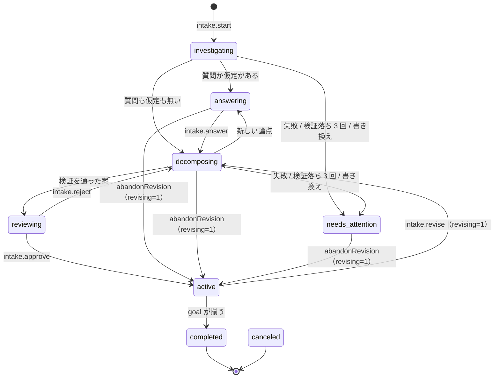

# 6. Intake

Epic 粒度の Issue を、人がレビューした計画（PFD）と、順に流れるタスクに変える機能である。
プロダクトとしての要求は [Intake の PRD](../prd/intake.md)、設計は
[`2026-09-21-intake-core-design.md`](../superpowers/specs/2026-09-21-intake-core-design.md) にある。

## 6.1 全体の流れ

1. `intake.start` — 調査エージェントが Issue とリポジトリを読み、**質問**（人の判断が要る論点）と**仮定**（根拠から導いた結論）を返す
2. `intake.answer` — 人が答え、仮定を認めるか書き直す
3. 分解エージェントが Issue を **PFD**（成果物とプロセスの 2 種類の要素だけからなる図）に割る。デーモンが規則で検証し、通った案だけが人に届く
4. `intake.reject`（要素ごとのコメント付き）か `intake.approve`（表示している案のハッシュ付き）
5. 承認されると、見張りがプロセスごとに sub-issue を作り、入力の成果物が揃ったエージェントのプロセスを普通のタスクとして投入する
6. 見張り（120 秒周期）が PR のマージを観測し、マージコミットが `origin/<baseBranch>` に届いたら下流を投入する。goal の成果物がすべて揃えば `completed`
7. 途中で改訂（投入済みの部分は固定）、止まったプロセスの再投入、中止ができる

**承認と人のプロセスの完了記録は人だけが行う。** 経路は RPC だけで、dctl にもエージェントの道具（`INTAKE_ALLOWED_TOOLS`）にも無い。
**進行の正本は DB にある。** sub-issue は外への表示で、人が閉じたり書き換えたりしても進行は変わらない。

## 6.2 モジュール

| 場所 | 中身 |
| --- | --- |
| `shared/intake/` | アプリと共有する型・スキーマ・純関数（質問・仮定・回答、PFD、差し戻しと回答の文面、sub-issue の本文、プロセス状態、トラッカーの型） |
| `core/src/intake/commands.ts` | RPC の実体（開始・回答・差し戻し・承認・改訂・中止・人の完了など） |
| `core/src/intake/runner.ts` / `conversation.ts` / `output.ts` / `prompt.ts` | エージェント実行、会話の続きの組み立て、出力の検証、プロンプト |
| `core/src/intake/revision.ts` | 改訂で固定する部分 |
| `core/src/intake/dispatch.ts` | 投入 |
| `core/src/intake/subIssueSync.ts` / `issueStateSync.ts` | sub-issue の同期、Linear の状態の同期 |
| `core/src/intake/watch.ts` | 見張り |
| `core/src/intake/view.ts` | RPC の応答の組み立て |
| `core/src/intake/pfd/` | PFD の規則検証・ハッシュ・プロセス状態の計算・タスク prompt |
| `core/src/tracker/` / `github/` / `linear/` | トラッカーの抽象と実装 |

## 6.3 状態機械

状態は `intakes.state`（`shared/intake/state.ts:IntakeState`）で、遷移表は `core/src/domain/intakeStates.ts:INTAKE_TRANSITIONS`。
**改訂中と上限待ちは状態ではなく列で表す**（`revising = 1`、`rate_limited_until`）。

| 状態 | 意味 |
| --- | --- |
| `investigating` | 調査中 |
| `answering` | 回答待ち |
| `decomposing` | 分解中（改訂中なら改訂の実行） |
| `reviewing` | 案のレビュー待ち |
| `active` | 承認済み。sub-issue・投入・見張りが動く |
| `needs_attention` | 調査・分解の実行が失敗した |
| `completed` / `canceled` | 終端 |



どの非終端状態からも `intake.cancel` で `canceled` へ移れる（図では省略）。

- `active → needs_attention` の辺は無い。承認後の失敗（sub-issue の作成、gh、タスクの停止）は Intake の状態を変えず、見張りの健康状態とプロセスごとの状態で見せる。1 つのプロセスの失敗で他の投入を止めないため
- 遷移表には `needs_attention → investigating / decomposing`（やり直し）の辺もあるが、それを起こす RPC（`intake.retry`）は未実装である（[10 章](10-known-gaps.md)）
- 書き込みはすべて `db/intakes.ts:updateIntake(..., { requireState })` で行い、遷移の正しさは呼び出し側が `assertIntakeTransition` で確かめる
- 状態を変えた操作は `IntakeTransition` を返し、ハンドラが `intake.stateChanged` を配る。状態以外の変化は `intake.updated`

## 6.4 エージェント実行（runner）

### 実行の行と受付

- エージェント呼び出し 1 回が `intake_runs` 1 行になる。`purpose` は `investigate` / `decompose` / `revise`
- `enqueueIntakeRun` が行を `queued` で立てる。1 秒の tick が `startIntakeRuns` で全体枠の空きの分だけ `claimIntakeRun`（`queued` のときだけ `running` にする）し、`runIntakeRun` を待たずに起動する
- タスクより先に受け付ける。プロジェクト枠は取らない

### `runIntakeRun` の流れ

1. Intake が期待する状態でなければ（中止済みなど）行を `interrupted` で閉じて終わる
2. worktree が無ければ `createDetachedWorktree`（`<stateRoot>/worktrees/<repo>/intake-<id>`、baseBranch から detached）。Intake の間ずっと同じ worktree を使う
3. 会話の続きの文面を DB から組み立てる（6.4.2）。会話の最初なら Issue をトラッカーから読み、初回のプロンプトを組む
4. `driveAgent` で起動する。許可するのは読み取り系の道具だけ（`INTAKE_ALLOWED_TOOLS`: `Read` `Grep` `Glob` と読み取り系の Bash）。構造化出力のスキーマは `shared/intake/decomposer.ts:decomposerJsonSchema`
5. **成否より先にリポジトリの書き換えを見る。** `git status` に変更があれば worktree を戻し、出力を捨てて `needs_attention`（`wrote_repository`）
6. 失敗なら利用上限の判定（タスクと同じ `classifyRateLimit`）。上限でなければ `needs_attention`（`agent_failed`）
7. 成功なら出力を検証して確定する（6.4.1）

### 6.4.1 出力の検証と確定

出力はトップレベル 1 つのオブジェクトで、`kind: "questions" | "pfd"` と 4 つの欄を持つ（`decomposerOutputSchema`）。
`output.ts:checkDecomposerOutput` が次の順で検証する。

1. 出力があるか → 形 → `kind` と欄の対応
2. `questions` なら、質問と仮定の検証（6.5）。分解・改訂で空を返すのは違反（調査で空を返すのは正しい）
3. `pfd` なら、調査の実行が PFD を返すのは違反。`validatePfd`（6.6）、改訂なら固定部分の検証、`replies`（差し戻しコメントへの返答）の番号の範囲

確定はすべて `runner.ts:settle` の 1 トランザクションで行い、読んだときの状態から変わっていれば何も書かずに行を `interrupted` で閉じる。

| 出力 | 遷移 | 同時に書くもの |
| --- | --- | --- |
| 検証落ち（連続 3 回未満） | なし | 行を `failed` + 違反。同じ purpose の実行を立て直す |
| 検証落ち（連続 3 回目） | `needs_attention` | `invalid_output` |
| 質問か仮定がある | `answering` | 質問のまとまり |
| 質問も仮定も無い（調査のみ） | `decomposing` | 分解の実行 |
| PFD | `reviewing` | 案（正規化 JSON とハッシュ） |

### 6.4.2 会話の続き

- 開始から最初の承認までは 1 つの Claude の会話を続ける（調査 → 回答 → 分解 → 差し戻し）。改訂に入るときに会話を捨てて新しく始める
- `conversation.ts:continuationMessage` が「次に送る文面」を**毎回 DB の行から導く**。再起動や上限待ちをまたいでも同じ文面になる
  - 直前の有効な実行が検証落ち → 違反の一覧を返して直させる
  - 質問を返した → 人の回答（`shared/intake/answerText.ts:buildAnswerText`）
  - PFD を返した → 案に付いた差し戻しコメント（`shared/intake/feedback.ts:buildFeedback`）
  - 上限待ち・中断・エージェント自体の失敗の行は飛ばす
- 連続の検証落ちはカウンタを持たず、行から数える（`consecutiveInvalid`）

### 6.4.3 利用上限

タスクと同じ判定で待つ。待つ間は状態を変えず、`intakes.rate_limited_until` を入れる。期限が来たら
`releaseDueIntakeRateLimited` が同じ purpose の実行を立て直す（試行回数は進めない）。5 回続けて待った後、または 6 時間を超える待ちなら `agent_failed`。
Intake の上限待ちも `hasActiveRateLimit` に数えるので、その間は全体の新規受付が止まる。

## 6.5 質問と仮定

型は `shared/intake/question.ts`（すべて strict）。

- `Question`: `id` / `prompt` / `kind`（single / multiple / free）/ `options[]` / `materials[]`（text / table / code / diagram。図は Review Guide と同じスキーマ）
- `Assumption`: `id` / `statement` / `evidence[]`（1 件以上。issue / code / convention）/ `impact`
- `Answer`、`AssumptionResponse`（`accepted` か、`corrected` と書き直した内容）

**質問に推奨を付けない**という約束は、型に推奨の欄が無いこと（strict なので足すと形の違反）と、プロンプトの指示で守る。説明文の中で推すことは型では防げない。
推奨を付けないのは、人が選択肢を比べる前に答えを差し出すと熟慮を飛ばさせるためである（overview 5.1）。

検証は `shared/intake/validateQuestion.ts`（id の重複、選択肢の有無、表の列数）と `core/src/intake/output.ts`（過去のまとまりと id が重ならない）が行う。
回答の検証（全質問に答えている、選んだ選択肢が実在する、書き直しは空でない）も shared にあり、画面も同じ関数を使う。回答は 1 度だけ書ける。

## 6.6 PFD

### モデル（`shared/intake/pfd.ts:pfdSchema`）

```
Pfd      = { title, goal: string[], artifacts: Artifact[], processes: Process[] }
Artifact = { id, name, given: boolean, decision?, description?, verify? }
Process  = { id, name, actor: "agent" | "human", inputs: string[], outputs: string[], purpose?, steps?, done_when? }
```

プロセスは成果物の id だけを参照し、プロセス同士の順序は書かない。実行の順序は成果物の入出力から決まる。
`decision` は質問か仮定の id を指し、その中身はエージェントではなくデーモンが回答から埋める（タスクの prompt を組むとき）。

### 規則（`core/src/intake/pfd/validate.ts:validatePfd`）

全違反を集めて返し、runner がそれをエージェントに返して直させる。

| 規則 | 条件 |
| --- | --- |
| `duplicate_artifact` / `duplicate_process` | id の重複 |
| `no_input` / `no_output` | 入力か出力が無いプロセス |
| `undefined_artifact` | 未定義の成果物を指している |
| `multiple_producers` | 1 つの成果物を複数のプロセスが出力する |
| `given_has_producer` / `no_producer` | given なのに作り手がいる / given でないのに作り手がいない |
| `unused_artifact` | goal でも誰かの入力でもない |
| `no_verify` | given でない成果物に確かめ方が無い |
| `missing_definition` | エージェントのプロセスに purpose / steps / done_when が無い |
| `cycle` | プロセスの依存に循環がある |
| `goal_unreachable` | given から辿って goal に届かない |
| `decision_not_given` / `unknown_decision` | decision を持つ成果物が given でない / 回答済みでない id を指す |
| `frozen_changed` | 改訂で固定された部分が変わっている |

加えて、取りやめたプロセスの id の再利用（`retired_reused`）を `revision.ts:revisionIssues` が DB の履歴から検出する。

### ハッシュと承認

- 案は `canonicalJson`（キーを辞書順にし `undefined` を落とした JSON）で保存し、その SHA-256 を `hash` に持つ。案は書いたら変えない
- `intake.approve` は `draft_id` と、**画面が表示していた案の `hash`** を受け取る。最新の案がその id で、ハッシュが一致し、状態が `reviewing` のときだけ承認を追記する。人が見ていない内容を承認させないため
- 投入・改訂・人の完了の前に `dispatch.ts:loadApprovedPlan` が「承認のハッシュ ＝ 案のハッシュ ＝ 案の本文の SHA-256」を確かめ、食い違えば何もしない

### プロセスの状態（`core/src/intake/pfd/status.ts:computeProcessStatuses`）

外部に問い合わせない純関数で、DB の事実（タスク、PR の観測、人の完了）から決める。

1. 入力を見ずに決まるもの: 人の完了があれば `done`。PR がマージ済み（baseBranch 宛て）なら `merged`、開いていれば `pr_open`、閉じていれば `needs_attention(pr_closed)`。
   PR が無ければ、タスクが `completed` なら `needs_attention(no_pr)`、`failed` / `canceled` なら `needs_attention(task_stopped)`、それ以外は `running`
2. **揃った成果物** = given ＋ `merged` / `done` のプロセスの出力。PR が開いただけ、タスクが完了しただけでは揃わない
3. 残りは、入力が揃っていなければ `waiting`、人のプロセスなら `your_turn`、エージェントのプロセスなら `ready`（改訂中・一時停止中・sub-issue が無いときは `blockedBy` 付き）

**成果物は baseBranch にマージされたものである。** タスクの間で成果物を直接渡す経路は無く、下流のタスクは上流の PR がマージされた後に作られるので、
worktree を切った時点で上流の成果物を持っている。

## 6.7 承認の後

### sub-issue の同期（`subIssueSync.ts:syncSubIssues`）

初回・やり直し・改訂のすべてを 1 つの関数で扱い、何度呼んでも同じ結果になる。

1. 取りやめたプロセスの sub-issue を `not_planned` で閉じる
2. sub-issue の URL が未記録のプロセスがあれば、親の sub-issue 一覧を 1 回取り、本文末尾の目印 `doctrine:intake=<intakeId> process=<processId>` で採用する。
   **一覧を取れなかった回は作らない**（探せないまま作ると重複する）
3. 上流から順に、紐づけの無いプロセスの sub-issue を作る。作った後に DB への記録が失敗しても、次の回に目印で採用されて重複しない
4. 本文のハッシュが変わったものだけ更新する
5. 人の完了済みのプロセスの sub-issue を `completed` で閉じる

失敗は Intake の状態を変えず、見張りの健康状態に積む。

### 投入（`dispatch.ts:dispatchIntake`）

- 条件: `active`、改訂中でない、一時停止中でない、承認のハッシュが揃っている
- `ready` で sub-issue があるエージェントのプロセスごとに、`core/src/intake/pfd/prompt.ts:buildTaskPrompt` でプロンプトを組み（目的・前提・人が決めたこと・作るもの・手順・完了条件）、タスクを作る。
  タイトルはプロセス名、ワークフローはプロジェクトの既定、`issue_url` は sub-issue
- **二重投入の防止**: `insertTask` と `replaceCurrentTask`（読んだ `current_task_id` と一致するときだけ置き換える）を 1 トランザクションで行う。0 行なら巻き戻す
- `intake.redispatch` は `needs_attention` のプロセスに新しいタスクを作って置き換える。古いタスクは記録として残し、worktree は消す

### 見張り（`watch.ts`）

120 秒ごと（`WATCH_INTERVAL_MS`）と、承認・改訂の放棄・一時停止の解除・人の完了・`intake.refresh` のときに、プロジェクト単位で 1 周回る。
周が走っている間に来た要求は、その周の後にもう 1 周回す。

1. `active` か改訂中の Intake を集める。無ければ何もしない（gh も呼ばない）
2. `active` ごとに sub-issue を同期する
3. PR を観測する（`observePullRequests`）。まだマージを観測していないタスクのブランチをまとめて、GraphQL 1 クエリ（50 別名ごと）で `gh` に問い合わせる。
   **トラッカーが Linear でも PR は GitHub を見る**
4. `git fetch origin <base>`。**失敗した周は投入しない**（古い base から切ると下流が上流の成果物を持たない）
5. 観測したマージコミットが `origin/<base>` に届いているか（`git merge-base --is-ancestor`）を確かめてから投入する
6. Linear なら sub-issue の状態を進める
7. goal が揃っていれば `completed`。親 Issue は閉じない（`intake.closeIssue` で人が閉じる）

健康状態（`WatchHealth`: 最後に成功した時刻、連続失敗の回数、最後のエラー）はメモリだけに持ち、画面へ `IntakeSummary.watch` として渡る。

### 改訂

- `intake.revise` で `active → decomposing`（`revising = 1`）。改訂の実行を先に立て、改訂開始のコメントをそれに紐づける。会話は新しく始める
- 改訂中は投入しない。走っているタスクには触らず、PR の観測は続ける
- **固定される部分**: 一度でも投入されたか人が完了したプロセスと、その入出力の成果物（`revision.ts:frozenProcessIds` と `frozenPart`）。
  改訂の出力と再承認の両方で、固定部分が一字も変わっていないことを検証する
- 再承認で `intake_processes` を案に揃える（増えた行を足し、消えたプロセスに `retired_at` を付ける。行は消さない）
- `intake.abandonRevision` で改訂をやめて元の承認に戻る

### 中止と人のプロセス

- `intake.cancel`: `leave` は Intake だけを止める。`stop` はさらに走っているタスクを止め、開いている sub-issue を閉じる（マージ済みのものは PR の Closes に任せる）
- `intake.completeHumanProcess`: `your_turn` の人のプロセスに、決めた内容（note。必須）を記録する。note は下流のタスクの prompt にそのまま載る

## 6.8 Issue トラッカー

### 抽象（`core/src/tracker/tracker.ts`）

```ts
interface Tracker {
  readonly kind: "github" | "linear";
  status(projectPath): Promise<TrackerStatus>;
  listIssues(projectPath, { assignee: "me" | "any"; search? }): Promise<IssueSummary[]>;
  readIssue(projectPath, url): Promise<IssueDetail>;
  createSubIssue(projectPath, parent, { title, body }): Promise<IssueRef>;
  findSubIssues(projectPath, parent): Promise<SubIssue[]>;
  updateIssue(projectPath, issue, { title, body }): Promise<void>;
  closeIssue(projectPath, issue, reason: "completed" | "not_planned"): Promise<void>;
  advanceIssue(projectPath, issue, phase: IssuePhase): Promise<void>;
}
```

Issue は `IssueRef = { url, nodeId }` で指し、番号を前提にしない。呼び出し側は必要な部分だけを `Pick<Tracker, ...>` で受ける（テストの偽物を小さくするため）。

### 選び方（`core/src/daemon/tracker.ts:trackerFor`）

`project.yaml` の `tracker` を**呼ぶたびに読む**ので、切り替えにデーモンの再起動は要らない。既定は `{ kind: "github" }`。

| | GitHub | Linear |
| --- | --- | --- |
| 経路 | `gh` CLI（認証は gh に任せ、デーモンはトークンを持たない） | GraphQL を直接 fetch（`config.json` の `linearApiKey`） |
| 設定 | 省略時の既定 | `tracker: { kind: linear, team, states? }` |
| 使えない理由 | `not_installed` / `not_logged_in` / `no_github_remote` | `no_api_key` / `invalid_api_key` / `team_not_found` |
| sub-issue の作成 | GraphQL の `createIssue(parentIssueId)` 1 回（REST だと途中失敗が残る） | `issueCreate(parentId)`。親の担当者を引き継ぐ |
| 状態の前進 | 何もしない | todo → inProgress → inReview。人が先へ進めた Issue は戻さない |

`gh` に渡す GraphQL の変数はすべて `-f`（生の文字列）で渡す。`-F` は型変換と `@` 始まりのファイル読み込みをするので、本文やブランチ名に使わない。

## 6.9 旧 `pfd/` CLI との対応

`core/src/intake/pfd/` は旧 `pfd/` から移植したものだが、import はしていない。

| 旧 `pfd/` | 現行 |
| --- | --- |
| YAML の PFD（Issue 番号あり） | `shared/intake/pfd.ts`（JSON の構造化出力、`decision` 付き） |
| 13 の規則 | 同じ 13 の規則 ＋ `decision_not_given` / `unknown_decision` / `frozen_changed` / `retired_reused` |
| `gh pr list` と `dctl ls` で状態を計算 | DB の事実から計算する純関数 ＋ 見張りの GraphQL 一括観測 |
| タイトルの接頭辞 `[pfd:<issue>/<process>]` で二重投入を防ぐ | `tasks.intake_id` / `intake_process_id` ＋ 比較付き置き換え |
| `dctl add` を叩いて投入 | DB に直接 `insertTask` |
