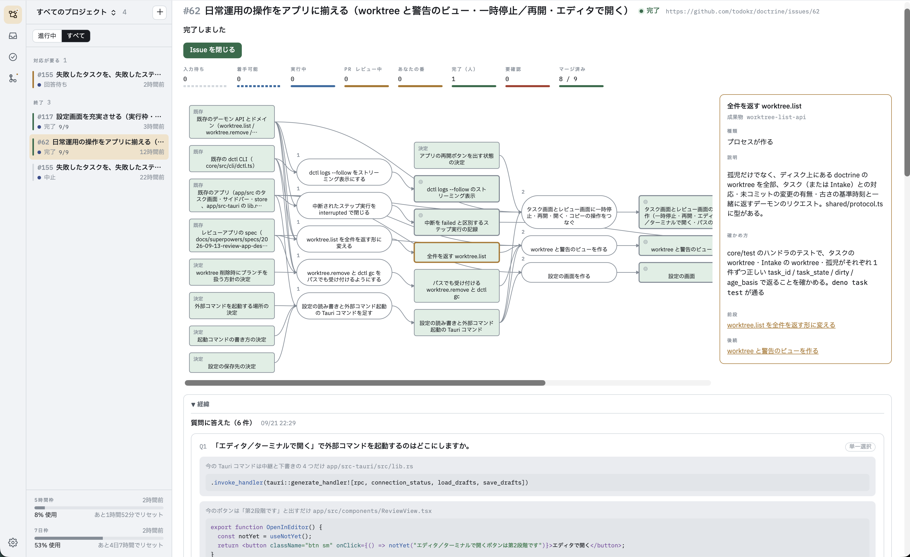
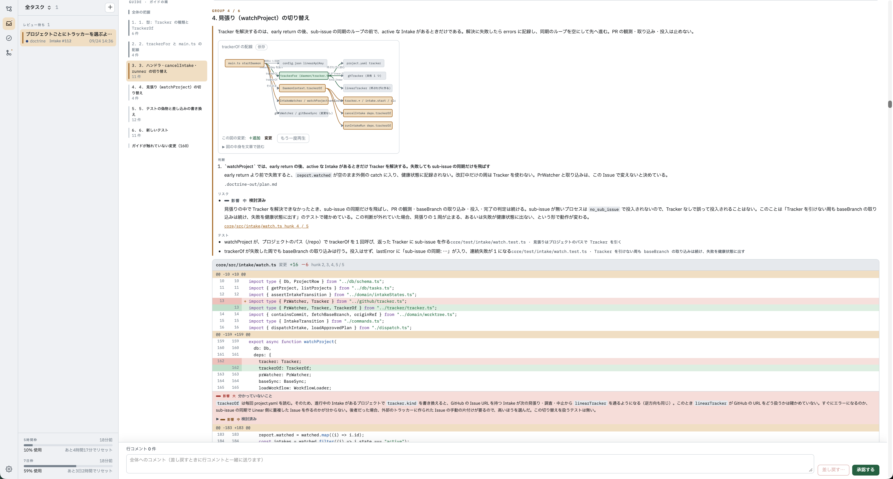

# doctrine

このドキュメントは doctrine というプロダクトが**何であるか**を定める。
個別の設計判断は各specに委ね、ここでは全体像・原則・用語だけを扱う。

## 1. doctrine とは

**doctrine は、手元のマシンで動く software factory である。**

Epic 粒度の Issue を受け取り、タスクへの分解、実装計画、実装、テスト、レビュー、PR の作成、マージまでの見届けを、
決められた手順どおりにエージェントに進めさせる。手順は**ワークフロー**としてプロジェクトごとに定義し、
エージェントはその枠の外へ出られない（計画する → 計画を人間にレビューさせる → 実装する → テストを流す
→ 変更を人間にレビューさせる → PR を作る → マージを待つ、など）。

doctrine が自動化するのは判断までの作業であり、判断そのものは人に残す。
Issue をどう割るか、計画を通すか、変更を受け入れるか、PR をマージするかは人が決める。
doctrine は判断が要る箇所で止まり、分解の案や変更を、指示・差し戻し・テスト結果といった**経緯と一緒に**人へ届ける。
人はそこで承認か差し戻しかを決める。

## 2. 解こうとしている問題

### 2.1 ボトルネックは「書く」から「理解する」へ移る

エージェントによって実装のコストが大きく下がると、人にとってのボトルネックは**コードを書くこと**から**AIが作ったものを理解し、正しいかを判断すること**へ移る。

仕事の進め方の計画をレビューするにあたっては、

- なぜこのようにタスクを細分化したのか
- どのタスクがどの成果物を生むのか
- Issue にもコードにも書かれていないことを、エージェントがどう埋めたのか

が、完成した計画の中に埋もれて届く。エージェントは人が決めるべきことまで黙って決めてしまい、
人は計画を読みながら、その裏にある判断を自分で掘り起こさなければならない。
読んで違和感が無ければ通してしまいやすいが、計画の誤りは後のコードレビューでは見つからない。
PR は 1 つずつ見れば正しく、誤っているのはそれらが立っている前提だからである。
人はそれを、十数個の PR を受け取ってから知ることになる。

コードをレビューするにあたっては、

- 何のための変更なのか
- 何が変わったのか（ファイル単位ではなく、概念単位で）
- なぜこの設計なのか
- どこにリスクがあるのか
- どこから読めばよいのか

を毎回自分で組み立てなければならない。特にエージェントを並列に用いる状況では、これらの把握が負担になる。

この詰まりこそが、AIによる生産性向上を頭打ちにしている課題である。

### 2.2 エージェントに規律を持たせる

エージェントを素で走らせると、**毎回違う進め方をする**。プロンプトで手順を定めたとしても、テストを流さずに終わることもあれば、確認なくコミットまで進むこともあったりと、人間が期待する手順から外れる動きを防ぐことができない。

doctrine はこれをプロンプトに任せない。  

**ワークフロー定義が手順そのものであり、エージェントはその枠の中でしか動けない。**
「テストが通るまで実装ステップに戻る」「PRを作る前に必ず人の承認を挟む」など、人間が定めた手順に沿って動くことをエージェントに強制する。

### 2.3 人が書く仕事は、レビューしきれる大きさより大きい

人が Issue トラッカーに書く仕事は「〇〇機能を追加したい」のような Epic 粒度であることが多い。
これをそのままエージェントに渡すと、人が一度でレビューしきれない PR が返ってくる。理解した上で判断する、という前提がここで崩れる。

割ってから渡せばよいが、割った後にも手間が残る。どの仕事がどの仕事の成果を待つのかを覚えておき、
上流の PR がマージされるたびに次の仕事を始める。これは人が機械の代わりに待ち合わせをしている状態であり、
忘れた分だけ下流が止まる。

## 3. 提供する価値

doctrine が提供する価値は、

> **エージェントに任せた作業は、事前に定めた手順に沿って進行される。**  
> **判断以外の作業は doctrine が引き受け、人の手は判断にだけ使われる。**  
> **作業の意図や結果は、図表やアニメーション交えた文章など人間の理解にとって最適な形で届き、人間は自信を持って承認や差し戻しの意思決定ができる。**  
> **結果、人間はアウトプットをすみずみまで理解し、プロダクトのさらなる進化に必要なメンタルモデルを構築することができる。**

判断以外の作業とは、たとえば次のようなものである。

- **依存関係に沿った投入。** 上流の PR がマージされると、その成果物を待っていた下流のタスクが自動で作られる。
人が待ち合わせを覚えておく必要も、投入のコマンドを叩く必要も無い（5.1）
- **conflict の自動修復。** PR を開いた後に baseBranch と conflict したら、doctrine が取り込んで直し、テストを通して push し直す。
人が手元でブランチを取り直す必要は無い（5.4）
- **利用上限からの自動再開。** Claude の利用上限に当たっても作業は捨てられず、枠が明ければ同じ会話から続く（5.5）
- **並列実行。** 互いに待ち合わせる必要のないタスクは、実行枠の範囲で同時に進む（5.2）

これらによって、人は Epic を始めてから終えるまで、端末でコマンドを叩くことなく、届いたものを判断することに専念できる。

doctrine は何のために・何が・なぜ変わったかの理解を人間に促し、判断の理由を人間が自分の言葉で説明できるよう支援することで、判断の質を支える。

そのため doctrine が自動化するのは最終的な判断までの作業であり、判断そのものは自動化しない。
人の操作から削るのは作業の摩擦（コマンドを叩く、マージを待ち合わせる、次の仕事を始めるのを思い出す、conflict を直す）であり、
判断の摩擦は残す。

## 4. 利用者と利用場面

利用者は、doctrine を自分のマシンで動かしている 1 人の開発者である。GitHub Issues か Linear に Epic 粒度の Issue を持ち、
それを数個から十数個の PR に割って進めたい。

### 4.1 Issue から完了まで

朝、doctrine の Intake ビューを開く。プロジェクトを選ぶと、自分が担当の Issue が並んでいる。
今週取り組む Epic を選んで「Intake を開始」を押す。

エージェントが Issue とリポジトリを調べている間に、コーヒーを淹れる。戻ると、計画を立てる前に決めておくべき方針が
**質問と仮定のまとまり**として届いている。質問には選択肢と判断材料（比較表・図・コード片）が付いているが、
エージェントの推奨は付いていない。判断材料を読み比べて、自分で選ぶ。仮定のほうは、エージェントが Issue やコードや慣習から
導いた結論が根拠つきで並んでいる。根拠と照らして確かめ、1 つは実情と違うので正しい内容を書き直す。

答えると、Issue を **PFD（Process Flow Diagram）** で分解した案が図として届く。Issue が「成果物」と、
成果物を入力に取って別の成果物を出力する「プロセス」に割られている。プロセス 1 つが、タスク 1 つ・PR 1 つ・sub-issue 1 つになる。
試してみなければ決められない判断は、人が行うプロセスとして図に置かれている。
図を読み、2 つのプロセスを指してコメントを付けて差し戻す。エージェントが同じ会話の続きで直した案を読み、承認する。

承認すると、プロセスごとに sub-issue が作られ、入力の成果物が揃っているプロセスがすぐにタスクになる。
互いに待ち合わせる必要のないタスクは並列に走る。人が行うプロセスが自分の番になれば、「あなたの番」として知らされる。

以後の仕事は、届いたものを判断することだけである。タスクは計画 → 計画レビュー → 実装 → テスト → コードレビューと
ワークフローどおりに進み（4.2）、人の承認が要る箇所で止まる。レビュー画面を開くと、変更が **Review Guide** に沿って
読む順に並び、解説と図が添えられている。読んで承認すると PR が開く。GitHub で PR をマージすると、
その成果物を待っていた下流のプロセスが数分のうちに次のタスクとして現れる。投入のコマンドを叩く必要は無い。

途中で「API の形はやはり別案がよい」と気づいたら、Intake を改訂に入れる。すでに動いた部分は固定されたまま、
まだ投入されていない部分の計画だけを直して承認し直す。PFD の末端の成果物がすべてマージされると Intake は完了になり、
親 Issue を閉じるかどうかを自分で決める。

この流れの中で人が判断するのは、次の 5 つである。

1. 質問への回答と仮定の確認
2. PFD の承認（差し戻しを含む）
3. 人が行うプロセス
4. タスクの中の承認（計画や変更のレビュー）
5. PR のマージ

それ以外は doctrine が進める。

**成果物は「baseBranch にマージされたもの」である。** タスクは互いに独立しており、タスクの間で成果物を
直接受け渡す経路は無い。下流のタスクは上流の PR がマージされた後に作られるので、worktree を切った時点で
上流の成果物を持っている。代償として、依存の連鎖は人の PR レビューを挟んで直列になる。これは受け入れる。
人が見ていない成果物の上に次の作業を積むことは、判断を人に残すという doctrine の目的と逆を向いている。

### 4.2 タスクから PR まで

1 つのタスクは、標準のワークフローでは次のように進む。

1. 計画エージェントが作業計画を立案（変更対象・方針・手順・影響範囲・テスト方針・リスク）
2. 別のエージェントが計画をレビュー（差し戻しは別ステップで計画エージェントが対応）
3. 実装エージェントが実装
4. レビューエージェントがコードレビュー（差し戻しは実装エージェントが別ステップで対応）
5. エージェントが**Review Guide**（人がこの変更を理解するために、何をどの順に読むとよいか）を作成する（5.3）
6. doctrine がレビュー画面を開き、ガイド付きのレビューが始まる
7. 人がレビューする — 修正依頼なら 3 へ戻る／承認なら次へ
8. baseBranch を取り込み、conflict があれば直してテストを通す（5.4）
9. PRを作成し、本文に要点（Why・What）を、ガイドのデータをPRコメントに載せる
10. PR がマージされるまで待つ。待っている間に baseBranch と conflict したら 8 へ戻って直し、push し直す（5.4）

### 4.3 今後

- **定時起動。** 「毎週月曜 10 時に自分の Issue を取り込む」ように、Intake の開始を時刻で起こす（#59）
- **ピアレビュー。** 他者が doctrine で作った PR を、PR コメントに載ったガイドを使って `dctl review <PR>` で読む

## 5. 主要な機能

### 5.1 Intake — PFD による分解

Epic 粒度の Issue を、レビューされた計画と、順に流れるタスクへ変える機能である（[Intake の PRD](prd/intake.md)）。
Intake はタスクではなく、Issue が完了するまで — 数日から数週間 — 生き続ける別の種類の実体としてデーモンが持つ。

- **分解の前に論点をすべて返す。** エージェントは Issue とリポジトリを調べ、PFD を作るうえで論点になることを洗い出す。
人の判断が要るものは質問、根拠から導けるものは結論と根拠の付いた仮定として、まとめて 1 回で届ける。
質問には推奨を付けない。推奨は、人が選択肢を比べる前に答えを差し出し、熟慮を飛ばさせるからである
- **PFD で割る。** 要素は成果物とプロセスの 2 種類だけである。実行の順序はプロセスの並びとしては書かず、成果物の入出力から決まる。
プロセスは、人が一度でレビューしきれる PR 1 つ、エージェントが 1 回でやりきれる、単独でマージして baseBranch が壊れない、
出力が単独で検証できる、の 4 条件を満たすまで割る（[PFD による分解](superpowers/specs/2026-09-20-pfd-decomposition-design.md)）
- **PFD を図としてレビューする。** 成果物・プロセス・全体にコメントを付けて差し戻せる。承認は、そのとき表示されている
PFD の内容に対して記録される。検証に通らない PFD は人に届かず、エージェントへ返って直される
- **sub-issue を作る。** 承認されると、プロセスごとに親 Issue の sub-issue を作る。PR は自分の sub-issue を閉じる
- **マージを見張って次を投入する。** デーモンが PR のマージを見張り、入力が揃ったプロセスを自動でタスクにする。
アプリを閉じていても動く。同じプロセスが二重にタスクになることは、デーモンが途中で落ちても無い
- **改訂と再投入。** 進行中の計画を、未投入の部分に限って直して承認し直せる。止まったプロセスはビューから再投入できる

*回答待ちの Intake。質問ごとに、コード片や表といった判断材料が付く。選択肢に推奨は付かず、選択肢以外の答えと選んだ理由を書ける。*

*完了した Intake の PFD。上にプロセスの状態ごとの件数が並ぶ。図の要素を選ぶと、右にその定義（説明・確かめ方・前段と後続）が出る。下の経緯からは、過去の質問と回答を読み返せる。*

### 5.2 ワークフローによるタスクの実行

タスクは、プロジェクト内に YAML で置いたワークフローに沿って進む。ワークフローは**ステップ**の並びで、ステップは次の 5 種類である。

| 種類         | すること                                                    |
| ---------- | ------------------------------------------------------- |
| `command`  | シェルのコマンドを実行する（テスト、lint、`git`、`gh` など）。再実行しても安全でなければならない |
| `agent`    | Claude Code に prompt を渡して作業させる。許す道具と、役割ごとの会話を指定する       |
| `approval` | 人の承認を待つ。差し戻しは指定したステップへ戻す                                |
| `guide`    | Review Guide を作らせる                                      |
| `poll`     | 外の状態が変わるまで待つ（PR のマージなど）。待っている間は実行枠を占有しない                |

ステップが失敗したり差し戻されたりしたときは、`goto` で指定したステップへ戻る。戻るたびの試行は
**ステップ実行**として記録され、何回目の試行で何が起きたかを後から辿れる。
ワークフローは、アプリの設定画面から図として確かめ、ステップを編集することもできる。

タスクごとに git worktree とブランチを 1 つずつ切り、リポジトリの外に置く。同時に走るタスクの数は**実行枠**で抑える。
実行枠には全体とプロジェクト単位の 2 つがあり、デーモンは空いた枠を見てタスクを順に起動する。
失敗や中止で止まったタスクの worktree は残り、人がそこから拾い直せる。

### 5.3 Review Guide

Review Guide は doctrine が提供する価値の中核をなす重要な機能である。

この機能は、

1. エージェントが行った作業の理解を容易にするため、 hunk を読むべき順番に並び替えてグルーピングし、
2. 解説となるテキストと図を添え、
3. 人間がインラインあるいは全体に対してのフィードバックをコメントできる

というものである。

人間はグループごとの解説と hunk を上から下へ読み進めるだけで、変更の全体を理解できる。

*Review Guide に沿ったレビュー画面。左にガイドの順に並んだグループ、右にそのグループの解説と依存図、続いて hunk が並ぶ。図の中の追加・変更・削除は色で分かれる。*

コードの移動・コピー・改名は「削除と追加」ではなく**移動として**表示し、人間が読む量を実質的な変更だけに絞る。

読む単位は hunk である。
ガイドは hunk を、doctrine が振った id（パスと hunk 本文から決まる）で指す。
行番号では指さない。行番号は diff の並び替えや後続の変更で動くため、箇所を指す名前にならない。
ファイルの新設やファイル単位の役割の変化のように hunk に落とせない話は、ファイル全体を指して紐づける。

解説においては、

- **Why** — 今回の実装が何を解決しているか
- **What** — 概念単位で何が変わったか
- **How** — 変更後のコードの構造（呼び出しの流れなど）
- **Key Decisions** — 重要な設計判断とその理由
- **Risks** — 壊しうるもの・置いた前提・分かっていないことを、事実として書く。読み手への指示は書かない。
種類は **壊しうるもの / 置いた前提 / 分かっていないこと / 検討したが問題なかった点** の4つで、最後の種類は何が検討済みなのかを人間に伝える。
該当する箇所（hunk id またはファイル全体）に紐づけ、項目からその箇所へ辿れるようにする。
各項目には、悪い方に転んだときに起きることの大きさ（影響: 大・中・小）を付ける。
影響は「どこを見るべきか」という指示の強さではなく、項目についての事実として付ける。指示として付けると人をその箇所だけに誘導し、AI だけのレビューと変わらなくなるため。どこから・どこまで読むかは人が決める。
確信の度合いは種類（分かっていないこと／検討したが問題なかった点）が持つので、影響には混ぜない。検討したが問題なかった点にも、その判断が外れていたときの影響を付ける
- **Tests** — 意図した振る舞いをどのテストが示しているか

を提供する。

解説生成の入力には git diff だけではなく、**タスクのライフサイクル全体**（Issue、計画、計画レビューの結果、diff、AIによるセルフコードレビュー結果、テスト結果、リポジトリ構造）を用いる。

説明に際しては文章だけでなく、図を適切に用い、人間の理解を容易にすることが非常に重要である。

図は自由な描画ではなく、決まった種類の構造化データとして持つ。
種類は **シーケンス図・関係図・依存／呼び出し図・状態遷移図** の4つである。
アニメーションはデータに持たせない。画面が構造化データを受け取って描画するときに付ける。
ガイドを作るエージェントは、何をどう動かすかを指定しない。

### 5.4 マージ待ちと conflict の自動修復

PR を開いたことはタスクの終わりではない。マージされたときが終わりである。
標準ワークフローは PR を開いた後も `poll` でマージを待ち、その間に baseBranch と conflict したら、
同じ worktree・同じ会話で baseBranch を取り込んで直し、テストを通して push し直す（[マージ待ちの設計](superpowers/specs/2026-09-22-merge-wait-design.md)）。

取り込みは merge で行い、rebase はしない。自動で解いた conflict は人に見直させず、解いた記録を PR にコメントする。
直しきれずに決められた回数を使い切ったら、タスクを失敗にせず人の判断を待つ。PR が閉じられたら、タスクは中止になる。

### 5.5 利用上限での待機

Claude の利用上限（5 時間枠・7 日枠）に当たると、エージェントの実行は途中で打ち切られる。
doctrine はこれを失敗として扱わない。タスクを**上限待ち**にし、枠が明ける時刻が来たら、
同じステップ・同じ会話から自動で再開する（[上限待ちの設計](superpowers/specs/2026-09-19-rate-limit-wait-design.md)）。

上限を失敗として扱えば、計画と実装を済ませた作業が、worktree・ブランチ・会話の続きごと捨てられる。
待っている間は全体の実行枠を手放し、上限で待った回はステップの試行回数に数えない。
Intake の調査・分解のエージェントも同じ規則で待つ。

### 5.6 Issue トラッカー

Intake が Issue を取り込み、sub-issue を作る先は、プロジェクトごとに GitHub Issues か Linear のどちらかを選ぶ。
どちらを使っても、PR は GitHub にあり、マージの検知は GitHub の PR を見て行う。

## 6. 想定する使われ方

- **作業を走らせるのは、1人の開発者の1台のマシン。** マルチユーザーもリモート実行も想定しない。
Intake の計画の正本もこのマシンにあり、チームから見えるのは sub-issue と PR である
- \*\*CIの代替ではない。\*\*doctrine は個人の作業机であり、手元の作業を進めるための道具である
- 対象エージェントは **Claude Code のみ**。汎用エージェントランナーを目指さない

## 7. 技術的指針

### プロジェクト構成

| サブプロジェクト | 内容                                                                                                                                         |
| -------- | ------------------------------------------------------------------------------------------------------------------------------------------ |
| コア       | ワークフロースキーマ、FSM＋永続化、worktreeライフサイクル、実行枠、Claude Code アダプタ、Intake（PFD の検証・状態計算・投入・マージの見張り）、Issue トラッカー（GitHub・Linear）                         |
| フロントアプリ  | タスク一覧のサイドバー、レビュー画面（diff・経緯の表示・ガイドの表示とガイドに沿った読み方の提示・行コメント・承認／差し戻し）、タスク画面、Intake ビュー（Issue の選択・質問と仮定・PFD のレビュー・進み具合）、設定画面（プロジェクト・実行枠・ワークフロー） |
| pfd      | Intake の前に doctrine の外で作った試作。Intake に置き換えたので、削除する                                                                                          |

### デーモンとネットワーク

デーモンはネットワークに触ってよい。Issue の取得、sub-issue の作成、PR のマージの検知は、アプリを閉じていても
動かなければ意味が無いので、デーモンが担う。GitHub へは `gh` を子プロセスとして呼び、認証は `gh` に委ねる。
デーモンは GitHub 向けの HTTP クライアントもトークンも持たない。Linear へは、デーモンの設定に置いた API key で API を呼ぶ。

## 8. 非ゴール

以下は**やらないと決めたこと**。

- **人の承認をAIで置き換えること**
  - AIのコードレビューは品質を上げるためにあり、人の判断の代わりではない。doctrine は判断を人に残すために判断までを自動化する
- **レート消費率に応じた実行枠の自動調整**
  - 消費率は記録するが、「7割使ったから枠を減らす」といった制御には使わない。
  ただし**上限に当たった後は待って再開する** — それは予測ではなく事実への対応であり、
  上限を失敗として扱えば進行中の作業が丸ごと捨てられる（5.5）
- **リモート実行とマルチユーザー**
  - 作業を走らせるのは自分のマシンだけであり、デーモンを共有したり他人のタスクを進めたりはしない
- **Claude Code 以外のエージェント対応**
- **CIの置き換え**
  - 手順を強制する点はCIに似て見えるが、ゲートする対象が違う。CIは共有された push 済みブランチを、人を挟まず再現可能に検査する。doctrine は**1人の手元の作業中のブランチ**を、**人の承認をループに含めたまま**進める

## 9. 用語

- **doctrine** — 本プロダクト
- **`dctl` / `dctld` / `.doctrine/`** — CLI・デーモン・プロジェクト設定ディレクトリ
- **タスク** — 1つのワークフロー実行。1つの worktree と1つのブランチを持つ
- **ワークフロー** — 手順の宣言的定義。プロジェクト内にYAMLで置く
- **ステップ** — ワークフロー定義中の1要素。`command` / `agent` / `approval` / `guide` / `poll` の5種
- **ステップ実行（step run）** — ステップの1回の試行。失敗時の巻き戻しにより
同一ステップが複数回実行され得る
- **権限拒否（permission denial）** — エージェントが呼んだ道具が権限で弾かれたこと。
実行の成否は変わらないので、そのステップ実行は `success` のまま終わり、何が弾かれたかは
ステップ実行の記録（`permission_denials`）に残る
- **上限待ち（rate\_limited）** — タスクの状態のひとつ。Claude の利用上限に当たって実行が
打ち切られ、枠が明ける時刻まで待っている状態。失敗ではなく、明ければ同じステップ・
同じ会話から自動で再開する
- **待機（waiting）** — タスクの状態のひとつ。`poll` ステップが「まだ」と答え、次に確かめる時刻まで待っている状態。
PR のマージ待ちがこれにあたる
- **実行枠（slot）** — 同時に実行中でいられるタスクの数。全体とプロジェクト単位の2スコープ
- **worktree** — タスクごとに切られる git worktree。リポジトリの外に置く
- **Review Guide** — 人が変更を理解するために、エージェントがタスクのライフサイクル全体から
作るナビゲーション（Why / What / How / Reading Order / Key Decisions / Risks / Tests）。
doctrine のコアは中身を理解せず、アプリがレビュー画面の diff をガイドの順に組み直して表示する。
タスクの実行中は worktree 内に置かれ、PR を作るときにデータがPRコメントへ、要点が本文へ載る
- **レビュー画面** — アプリの中心。承認待ちのタスクについて、作業の経緯・宣言されたファイル・diff を並べ、
行コメントを付けて承認／差し戻しを決める面（セルフレビュー）
- **ピアレビュー** — `dctl review <PR>` で開く、他者のPRを読む面（4.3）。ガイドはPRコメントから、diff はPRから読み、
判断はGitHub上の approve・コメント・変更要求として送る。doctrine の承認／差し戻しとは別物
- **Review Session** — Review Guide を1ステップずつ辿る対話的なレビュー。MVPの後に検討する
- **Intake** — Epic 粒度の Issue を選んで開始すると、決めるべき事項の問い、PFD による分解、人による PFD のレビュー、
sub-issue の作成、入力が揃ったプロセスのタスク化までを進める機能。承認の後は、PR のマージを検知して下流のタスクを自動で作る。
タスクとは別の種類の実体であり、Issue が完了するまで生き続ける
- **質問と仮定** — Intake が分解の前に人へ返す論点。人の判断が要るものは推奨の付かない質問、
根拠から導けるものは結論と根拠の付いた仮定として届く。回答と確かめた仮定は「決定の記録」として分解の入力になる
- **PFD（Process Flow Diagram）** — Issue をタスクに分解するための図。要素は成果物とプロセスの 2 種類だけで、
入力の成果物がすべて揃ったプロセスが「いま着手できる仕事」になる
- **成果物** — PFD の要素のひとつ。プロセスの入力または出力。baseBranch にマージされたときに「揃った」とみなす。
人が行うプロセスの成果物だけは、人が決めた内容の記録として受け渡す
- **プロセス** — PFD の要素のひとつ。成果物を入力に取り、別の成果物を出力する作業。エージェントが行うプロセスは
1つのタスク・1つのPR・1つの sub-issue になり、人が行うプロセスはタスクにならない（sub-issue にはなる）
- **sub-issue** — PFD の承認時に、プロセスごとに親 Issue の下へ作る Issue。進行の正本は Intake にあり、sub-issue は外への表示である
- **Issue トラッカー** — Intake が Issue を読み、sub-issue を作る先。GitHub Issues か Linear をプロジェクトごとに選ぶ

