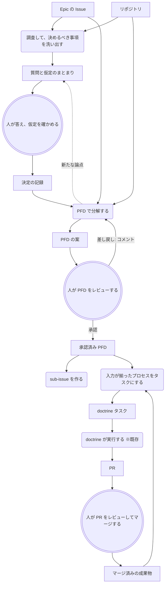
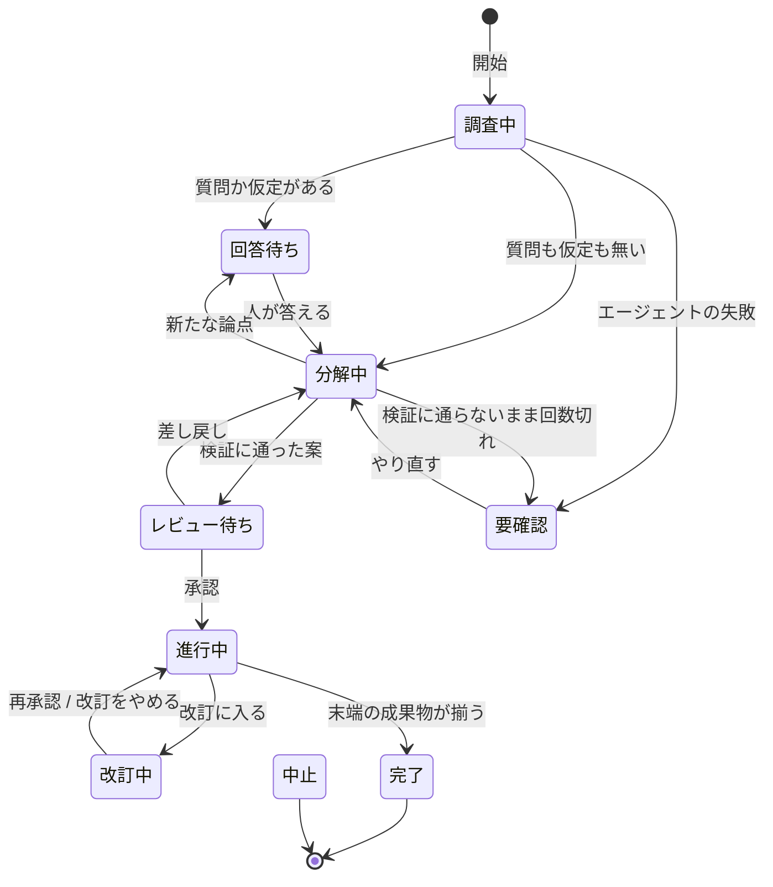

# Intake — 大きな Issue を、レビューされた計画と順に流れるタスクへ変える

- 日付: 2026-09-21
- 状態: 承認待ち
- issue: [#60](https://github.com/todokr/doctrine/issues/60)（本 PRD が方針を置き換える）
- 前提: [overview](../overview.md) 4.1、[PFD による Issue の分解](../superpowers/specs/2026-09-20-pfd-decomposition-design.md)
- この文書の範囲: 誰の何を解くか、どんな体験にするか、何を満たせば完成か。テーブル定義・RPC の形・画面の細部は、後続の設計 spec が定める

## 1. 背景と問題

doctrine のタスクは「1 つの worktree、1 つのブランチ、1 つの PR」の大きさである。一方、人が Issue トラッカーに書く
仕事はもっと大きい。「doctrine に Intake 機能を追加したい」のような Epic 粒度の Issue は、そのままタスクにすると
人が一度でレビューしきれない PR になり、doctrine が提供する価値（理解した上で判断できること）が成り立たなくなる。

overview 4.1 はこの隙間を埋める流れ — Issue を PFD で分解し、人が PFD をレビューし、入力が揃ったプロセスから
順にタスクにする — を製品の目標として定めている。この流れは `pfd` CLI とスキルとして doctrine の外に試作され、
回ることが確かめられた。ただし試作には、使い続けるには重い点が残っている。

| いま起きていること | 何が困るか |
|---|---|
| 分解の起動、図の表示、承認、投入がすべて端末のコマンドである | doctrine の画面の外で計画が進み、計画のレビューだけがレビュー画面の恩恵を受けない |
| 上流の PR をマージするたびに、人が `pfd dispatch` を叩く | 叩き忘れた分だけ下流が止まる。人が機械の代わりに待ち合わせをしている |
| 計画を立てる前に決めるべき方針が、分解の途中で場当たりに問われるか、問われないまま仮定される | 仮定の上に立った計画を、レビューで初めて知ることになる |
| PFD への指摘は会話で伝える | どの成果物・どのプロセスへの指摘かが記録に残らず、直ったかどうかを追えない |
| Issue とタスクの紐づけがタスクのタイトルの接頭辞である | タイトルを直すと紐づけが切れる。止まったプロセスをやり直すにはプロセスの id を変えるしかない |
| 進行中の Epic の全体が、`pfd status` を叩いたときにしか見えない | いまどこまで進み、自分の番が何かを、見に行かないと分からない |

**Intake は、この流れを doctrine 本体に取り込み、人の操作を「判断」だけに絞る。**

## 2. 目標と非目標

### 2.1 目標

1. Epic 粒度の Issue を選んで開始するだけで、分解・方針の確認・計画レビュー・タスクの投入が 1 つの面で進む
2. 計画を立てるのに必要な意思決定が、**計画が書かれる前に、まとめて**人に問われる
3. 人は PFD を図として読み、成果物やプロセスを指してコメントし、差し戻せる
4. 承認の後、人が待ち合わせをしない。上流の PR がマージされれば、下流のタスクは自動で作られる
5. 進行中の Epic について、全体の進み具合と「いま自分の番のもの」がいつでも見える

### 2.2 非目標

- **計画の承認を自動化すること。** Intake が自動化するのは承認の後の待ち合わせであり、承認そのものではない（overview 3 章）
- **マージされていない成果物の上に次の作業を積むこと。** 下流を速く始めるためのスタックブランチは持たない（5.1）
- **PR のマージを Intake が行うこと。** マージは人の判断であり、その自動化は #61 の範囲である。Intake はマージを検知するだけ
- **定時起動。** 「毎週月曜 10 時に自分の Issue を取り込む」は #59 が入った後に Intake の開始を繋ぐ。本 PRD では人が開始する
- **チームでの計画の共有・共同編集。** PFD の正本は 1 台のマシンにある（overview 6 章）。チームから見えるのは sub-issue と PR である
- **Linear 対応。** 構想として持つが、最初の版は GitHub Issues だけを扱う（11 章）

## 3. 利用者と利用場面

利用者は、doctrine を自分のマシンで動かしている 1 人の開発者である。Issue トラッカーに Epic 粒度の Issue を持ち、
それを数個から十数個の PR に割って進めたい。

典型的な場面:

- 朝、Intake ビューを開き、取り組む Issue を選んで開始する。コーヒーを淹れて戻ると、方針についての質問と、
  エージェントが根拠から導いた仮定がまとめて届いている。質問には推奨が付いていないので、判断材料を読んで自分で選ぶ。
  仮定は根拠と照らして確かめ、1 つは違うので正しい内容を書く。答えると PFD の案が届き、図を読んで 2 箇所にコメントして差し戻す。直った案を承認する
- 以後はいつもどおり、届いたタスクをレビューして PR をマージするだけである。マージのたびに次のタスクが勝手に現れる
- 途中で「API の形はやはり別案がよい」と気づく。Intake を改訂に入れ、まだ投入されていない部分の計画だけを直して承認し直す

## 4. 決定の要約

| 項目 | 決定 | 章 |
|---|---|---|
| 置き場所 | デーモンが持つ第一級の実体にする。ワークフローとしては実装しない | 5.2 |
| `pfd/` の扱い | PFD のモデル・検証・状態計算を本体に吸収し、`pfd` CLI とスキルは削除する | 9 |
| dispatch の契機 | 上流タスクの PR が baseBranch にマージされたとき。タスクの `completed` ではない | 5.1 |
| GitHub へのアクセス | `dctld` が `gh` を子プロセスとして呼ぶ。認証は `gh` のログイン状態に委ねる | 5.3 |
| 意思決定の問い方 | 分解の前にまとめて問う。後から論点が出たら、そのときもまとめて問う | 7.3 |
| 推奨 | 質問に推奨を付けない | 5.4・7.3 |
| 人に見せる論点 | PFD を作るうえでの論点をすべて見せる。人が決める論点は質問、根拠から導ける論点は結論と根拠の付いた仮定として届け、人が覆せる | 5.4・7.3 |
| 計画レビュー | PFD を図として表示し、成果物・プロセス・全体にコメントして差し戻す。承認は PFD の内容に対して記録する | 7.5 |
| sub-issue | 承認時にプロセスごとに作る（PFD spec の「作らない」を覆す） | 7.6 |
| 承認後の修正 | 未投入の部分だけ改訂して再承認できる。投入済みは固定する | 7.9 |
| 止まったプロセス | ビューから再投入できる | 7.9 |
| 親 Issue を閉じる | 自動では閉じない。完了したことを示し、人が閉じる | 7.7 |

## 5. 土台になる判断

### 5.1 「完了」とはマージである

要求の出発点は「依存先のタスクの完了をウォッチし、完了後に依存元を自動で dispatch する」である。
ここでの完了は、**タスクの `completed` ではなく、そのタスクの PR が baseBranch にマージされたこと**と定める。

doctrine のタスクは、標準ワークフローでは PR を開いた時点で `completed` になる。worktree は常に baseBranch から
切られるので、`completed` を契機にすると、下流のタスクは上流の変更を持たずに始まる。上流のブランチから worktree を
切れば持たせられるが、それは人が見ていない成果物の上に次の作業を積むことであり、上流が差し戻されれば下流は
巻き直しになる。overview 4.1 はこの代償を比べた上で「依存の連鎖は人の PR レビューを挟んで直列になる。これは受け入れる」
と決めている。Intake はこの決定を変えない。変えるのは、マージの後に人が投入のコマンドを叩く手間だけである。

### 5.2 Intake はタスクではない

#60 は「取り込みそのものを doctrine のワークフローにする」を方針の案としていた。既存の approval とレビュー画面に
そのまま乗る、という利点があったが、採らない。

Intake は Epic が終わるまで — 数日から数週間 — 生き続け、その間に何度もマージを検知してタスクを作る。
タスクは「1 つの worktree で進み、終わる」ものであり、この寿命に合わない。ワークフローとして実装すると、
Intake は `suspended` のまま居座ってプロジェクトの実行枠を消費し続け、サイドバーでは他のタスクに混じって
レビュー待ちの顔をする。専用のビュー、プロセスごとの状態、改訂といった要求も、タスクの形には収まらない。

したがって Intake は、タスクと並ぶ**別の種類の実体**としてデーモンが持つ。ただし、分解そのものは既存の
Claude Code アダプタでエージェントを走らせて行い、デーモンが Issue の中身を解釈することはない。
デーモンが受け持つのは、状態の保持、PFD の検証、入力が揃ったかの判定、タスクの作成という決定論的な部分である。
これは PFD spec 5 章の「判断が要る部分と決定論的に済む部分を分ける」をそのまま引き継いでいる。

### 5.3 デーモンはネットワークに触ってよい

これまでデーモンはネットワークに触らなかった。Intake では、Issue の一覧を出すこと、sub-issue を作ること、
マージを検知することに GitHub が要る。とくにマージの検知は、アプリを閉じていても動かなければ
「自動で dispatch する」にならない。アプリに呼ばせる案は、この一点で要求を満たさない。

Intake の先も、ネットワーク越しの仕事は増える見込みである（Linear、PR のマージ、通知の送り先）。
そのたびに例外を足す形にはしない。**デーモンはネットワークに触ってよい**ことにする。

GitHub については、その手段として `gh` を呼ぶ。デーモンは GitHub 向けの HTTP クライアントもトークンも持たず、
認証は `gh` に委ねる。`gh` が入っていない、またはログインしていなければ、Intake は使えないことを画面で告げ、
それ以外の doctrine の機能は従来どおり動く。

### 5.4 作業の摩擦は減らし、判断の摩擦は残す

Intake は人の操作を判断だけに絞る。しかし、判断の場面まで摩擦を無くすと、人は判断しなくなる。
流暢で自信ありげな出力には「何かおかしい」という引っかかりが起きにくく、熟慮が起動しないまま
エージェントの答えが人の答えになる。これを認知的降伏と呼ぶ（[t-wada のスライド 22](https://speakerdeck.com/twada/debt-metaphor-in-agentic-engineering-age-202609-edition?slide=22)）。
計画の段階で降伏が起きると、人は理解しないまま承認した計画から十数個の PR を受け取ることになり、
doctrine の目標（overview 3 章: 人が自分の言葉で判断の理由を説明できる）が Epic の単位で崩れる。

そこで Intake は摩擦を 2 つに分けて扱う。

- **作業の摩擦**（コマンドを叩く、マージを待ち合わせる、投入を思い出す）は無くす
- **判断の摩擦**は残す。人が決めることにエージェントの好みを添えない。エージェントが黙って決めたことを、人の目に触れさせる

最初の版では、意思決定の問いに次の 2 つを入れる（7.3）。

1. **推奨を出さない。** 推奨とその理由は、人が選択肢を比べる前に答えを差し出し、熟慮を飛ばさせる。
   人は選択肢と判断材料だけを見て決める
2. **論点をすべて見せる。** 人が決めるべき事項だけでなく、PFD を作るうえで論点になることを、エージェントが自分で決められるものも含めて洗い出す。
   根拠から導ける論点は、質問の代わりに「仮定」として結論と根拠を添えて届け、人が根拠と照らして認めるか覆す。
   これは好みの推奨ではなく事実との照合なので、結論を伏せて人に一から書かせることはしない

摩擦は判断の要所に絞る。毎回の必須入力のような一律の摩擦は、やがて中身の無い儀式になるので置かない。

## 6. 体験の流れ

`[ ]` が成果物、`( )` がプロセスである。二重線の枠は人が行う。

人が手を動かすのは、開始、質問への回答、PFD のレビュー、人が行うプロセス、そして従来どおりのタスクの承認と
PR のマージである。それ以外は Intake が進める。

## 7. 要求

優先度は **M**（最初の版に必須）と **S**（あるべきだが、無くても最初の版は成立する）で示す。

### 7.1 Intake ビュー

| # | 要求 | 優先度 |
|---|---|---|
| V-1 | 左端のレールに「全タスク」「終了したタスク」と並ぶ入口を持ち、専用のビューを開く | M |
| V-2 | ビューは Intake の一覧を出す。各行に、Issue の番号とタイトル、状態（8 章）、プロセスの進み具合（完了数 / 総数）、人の対応が要るかどうかを示す | M |
| V-3 | 人の対応が要る Intake（回答待ち・レビュー待ち・あなたの番・要確認）の件数を、レールの入口に示す。レビュー待ちのタスクの件数と同じ扱いである | M |
| V-4 | Intake を開くと、状態に応じた面が出る。回答待ちなら質問、レビュー待ちなら PFD のレビュー、進行中なら進み具合の付いた PFD | M |
| V-5 | 進行中の PFD は、プロセスを状態で塗り分ける（7.7 の状態）。プロセスを選ぶと、その定義、sub-issue、タスク、PR へ辿れる。タスクを選べば既存のタスク画面・レビュー画面へ移る | M |
| V-6 | Intake から作られたタスクは「全タスク」にも通常のタスクとして並び、どの Intake のどのプロセスかが分かる。そこから Intake へ戻れる | M |
| V-7 | 完了・中止した Intake は一覧の既定の表示から外し、切り替えて見られる | S |

### 7.2 Issue の選択と開始

| # | 要求 | 優先度 |
|---|---|---|
| S-1 | プロジェクトを選ぶと、そのリポジトリの open な Issue の一覧が出る。既定は自分が担当のものに絞り、絞り込みを外せる。タイトルで検索できる | M |
| S-2 | 一覧から Issue を選ぶと本文を確認でき、「Intake を開始」で始まる。番号や URL を直接入れて選ぶこともできる | M |
| S-3 | すでに進行中の Intake がある Issue は、一覧でそれと分かり、新しく開始できない。開始の代わりにその Intake を開く | M |
| S-4 | 1 つのプロジェクトで複数の Intake を同時に進められる | M |
| S-5 | `gh` が使えないとき（未インストール・未ログイン・リポジトリに GitHub の remote が無い）は、一覧の代わりに理由と直し方を示す | M |
| S-6 | Issue が Epic として小さすぎる（分解の結果、プロセスが 1 つになる）場合も Intake は成立する。そのまま 1 タスクとして流れる | S |

### 7.3 調査と、意思決定の問い

計画が人の知らない仮定の上に立たないよう、PFD を作るうえでの論点を計画の前にすべて人へ返す。

| # | 要求 | 優先度 |
|---|---|---|
| Q-1 | 開始すると、エージェントが Issue（本文とコメント）とリポジトリを調べ、**PFD を作るうえで論点になること**を、エージェントが自分で決められるものも含めて洗い出す。論点は、人の判断が要るもの（質問にする）と、Issue やコードや慣習から導けるもの（仮定にする）に分ける | M |
| Q-2 | 質問は小出しにせず、まとめて 1 回で届く。各質問は、問いの文、選択肢（単一選択・複数選択・自由記述）、選択肢ごとの説明、判断材料（比較表・図・コード片）を持つ。**エージェントの推奨は付けない。** 選択肢ごとの説明と判断材料も、どれかを推す書き方をしない | M |
| Q-3 | どの質問でも、用意された選択肢以外の答えと、補足を書ける | M |
| Q-4 | エージェントは、Issue やコードや慣習から導ける論点を質問にしない。質問の代わりに、導いた結論を**仮定**として届ける（Q-9）。質問も仮定も無ければ、この段を飛ばして分解へ進む | M |
| Q-5 | 回答と、確かめられた仮定（Q-9）はすべて「決定の記録」として Intake に残り、分解の入力になる。そのうち特定のプロセスの前提になる決定だけを、エージェントが最初から揃っている成果物として PFD に置き、そのプロセスの入力につなぐ。これは下流のタスクの prompt に「人が決めたこと」として届く。分解の形そのものを左右しただけの決定（どこで割るか等）は PFD の成果物にしない | M |
| Q-6 | 分解の途中、または差し戻しへの対応中に新たな論点が出たら、エージェントは分解を中断して再び質問をまとめて届ける。このときも小出しにしない。新たに置いた仮定も同じときに届ける | M |
| Q-7 | 過去の質問と回答、仮定とその扱いは、Intake のどの段階からも読み返せる | M |
| Q-8 | **実行してみなければ決められない判断**（例: 試作の結果を見て方式を選ぶ）は質問にせず、人が行うプロセスとして PFD に置く（7.8） | M |
| Q-9 | 仮定は、仮定の文、根拠（Issue の箇所、コードのパス、慣習）、崩れたときに計画のどこが変わるかを持ち、崩れたときの影響が大きい順に並ぶ。人は仮定ごとに、そのまま認めるか、違うとして正しい内容を書く。書いた内容は回答と同じく決定になる。認めたか書き直したかの区別は記録に残る | M |
| Q-10 | 人は答えを選んだ理由を書ける。書いた理由は決定の記録に付き、その決定を入力に取るタスクの prompt に「人が決めたこと」と一緒に届く | S |

### 7.4 PFD による分解

分解を通じて計画を精緻にする。PFD の規則・検証・粒度の条件は PFD spec（6 章・8 章）を引き継ぐ。

| # | 要求 | 優先度 |
|---|---|---|
| D-1 | エージェントは Issue を成果物とプロセスに分解する。成果物は、何であるかと単独での確かめ方を持つ。プロセスは、担い手（エージェント / 人）、入力、出力、目的、手順、完了条件を持つ | M |
| D-2 | 実行可能な順序はプロセスの並びとしては書かせない。成果物の入出力から決まる。ビューは、最初に着手できるプロセスと、並列に走れる組を示す | M |
| D-3 | プロセスは粒度の 4 条件（人が一度でレビューしきれる PR 1 つ / エージェントが 1 回でやりきれる / 単独でマージして baseBranch が壊れない / 出力が単独で検証できる）を満たすところまで割る | M |
| D-4 | 分解エージェントはリポジトリを読むだけで、書き換えない。出すものは PFD と質問と仮定だけである | M |
| D-5 | PFD の検証はデーモンが行う。検証に通らない PFD は人に届かず、何に反したかがエージェントへ返って直される。決められた回数で直らなければ Intake は「要確認」になる | M |
| D-6 | 分解エージェントの実行は、通常のタスクと同じ実行枠と上限待ちに従う | M |
| D-7 | 割りすぎを避ける。依存の段が 1 つ増えるごとに人の PR レビュー待ちが 1 回増えることを、エージェントは分解の基準として持つ | M |

### 7.5 計画レビュー

| # | 要求 | 優先度 |
|---|---|---|
| R-1 | 検証に通った PFD の案が届くと、Intake は「レビュー待ち」になり、人に通知される | M |
| R-2 | PFD を図として表示する。成果物とプロセスを形で区別し、人が行うプロセス、最初から揃っている成果物、末端の成果物を見分けられる。ネットワークが無くても描ける | M |
| R-3 | 図の要素を選ぶと、その定義の全文が読める。プロセスなら、それがタスクになったときの prompt も確認できる | M |
| R-4 | 成果物・プロセスのそれぞれに対して、また全体に対して、コメントを付けられる。コメントは要素の id に紐づき、図の上でコメントのある要素が分かる | M |
| R-5 | 「差し戻す」はコメントが 1 つ以上あるときだけできる。送る前に、エージェントへ届く文面を確認できる。既存のレビュー画面の差し戻しと同じ作法である | M |
| R-6 | 差し戻すと、エージェントは同じ会話の続きとしてコメントを受け取り、PFD を直して再び届ける | M |
| R-7 | 直された案では、前の案から変わった要素（追加・削除・変更）が分かり、自分の各コメントがどう扱われたかをエージェントの返答として読める | S |
| R-8 | 「承認」は、そのとき表示されている PFD の内容に対して記録される。承認の後で内容が変われば、承認は無効になる | M |
| R-9 | 承認は人だけが行える。エージェントが自分の書いた PFD を承認する経路を持たない | M |
| R-10 | 各回の案・コメント・質問と回答・仮定は、経緯として Intake に残り、後から読める | M |

### 7.6 sub-issue

PFD spec は sub-issue を作らないと決めていた。計画が自分のマシンの外から見えないことを受け入れた上での決定だったが、
Intake ではこれを覆す。Epic の進み具合が Issue トラッカーの上で見え、PR が自分の担う範囲の Issue を閉じる、
という普通の作法に乗せるためである。「プロセス 1 つ ＝ タスク 1 つ ＝ PR 1 つ」に「＝ sub-issue 1 つ」が加わる。

| # | 要求 | 優先度 |
|---|---|---|
| I-1 | PFD が承認されると、プロセスごとに親 Issue の sub-issue を作る。人が行うプロセスも含む | M |
| I-2 | sub-issue の本文は、プロセスの定義（目的・入力と出力の成果物・完了条件）から作る。先に終わっている必要があるプロセスの sub-issue を参照する | M |
| I-3 | タスクは自分の sub-issue を知っており、ワークフローから参照できる。標準ワークフローが作る PR は、その sub-issue を閉じる | M |
| I-4 | 人が行うプロセスの sub-issue は、人が完了を記録したときに Intake が閉じる | M |
| I-5 | sub-issue の作成は途中で失敗しても、やり直して重複を作らない | M |
| I-6 | 改訂（7.9）で無くなったプロセスの sub-issue は「取りやめ」として閉じ、増えたプロセスには新しく作り、変わったプロセスは本文を更新する | M |
| I-7 | sub-issue が人の手で閉じられたり書き換えられたりしても、Intake の進行は影響を受けない。進行の正本は Intake であり、sub-issue は外への表示である | M |

### 7.7 dispatch とウォッチ

| # | 要求 | 優先度 |
|---|---|---|
| W-1 | 承認されると、入力の成果物がすべて揃ったエージェントのプロセスが、ただちにタスクになる。追加の確認は挟まない。承認が投入の合図である。順序は「承認 → sub-issue の作成 → 投入」であり、sub-issue がまだ作れていないプロセスは投入しない（prompt と PR が sub-issue を参照するため） | M |
| W-2 | 成果物が揃ったとは、(a) 最初から揃っている、(b) それを出力するタスクの PR が **baseBranch に**マージされた、(c) それを出力する人のプロセスの完了が記録された、のいずれかである | M |
| W-3 | デーモンは進行中の Intake について PR のマージを見張り、新たに入力が揃ったプロセスを自動でタスクにする。**マージから 5 分以内**に下流のタスクが作られる。アプリが閉じていても動く | M |
| W-4 | ビューから「更新する」で、見張りの周期を待たずに確かめられる | M |
| W-5 | 同じプロセスが二重にタスクになることは無い。デーモンが途中で落ちても、再起動の後に同じ保証が保たれる | M |
| W-6 | タスクの prompt は、プロセスと入出力の成果物の定義、人が決めたこと、親 Issue と sub-issue から組み立てる（PFD spec 7.2 を引き継ぐ） | M |
| W-7 | 作られたタスクは通常のタスクと同じく実行枠と優先度に従う。Intake は枠を予約しない | M |
| W-8 | タスクと Intake・プロセスの紐づけは、タスクのタイトルではなく、タスクが持つ項目として保持する。タイトルを直しても切れない | M |
| W-9 | プロセスの状態を次のとおり見分けて示す: 入力待ち / 着手可能 / 実行中 / PR レビュー中 / マージ済み / あなたの番 / 完了（人）/ 要確認。要確認は、タスクが `failed`・`canceled` で止まった、タスクは `completed` なのに PR が無い、PR がマージされずに閉じられた、のいずれかで、どれであるかを示す | M |
| W-10 | 自動 dispatch を一時停止・再開できる。停止中も状態の表示は更新される | S |
| W-11 | 末端の成果物がすべて揃うと、Intake は「完了」になり、人に通知される。親 Issue は自動では閉じない。ビューに「Issue を閉じる」を出し、人が閉じる。Epic を受け入れるかどうかは人の判断である | M |
| W-12 | `gh` の一時的な失敗（ネットワーク断・API の制限）では Intake を止めず、次の周期でやり直す。失敗が続いていることはビューで分かる | M |

### 7.8 人が行うプロセス

| # | 要求 | 優先度 |
|---|---|---|
| H-1 | 入力が揃った人のプロセスは「あなたの番」として Intake ビューに出て、人に通知される | M |
| H-2 | 人は、決めた内容を書いて完了を記録する。内容は必須である。決めた内容がリポジトリにコミット済みなら、その場所を書けばよい | M |
| H-3 | 記録した内容は、その成果物を入力に取る下流のタスクの prompt に、そのまま載る | M |
| H-4 | 完了の記録は人だけが行える | M |

### 7.9 承認後の改訂・再投入・中止

| # | 要求 | 優先度 |
|---|---|---|
| C-1 | 進行中の Intake を「改訂」に入れられる。改訂中は自動 dispatch が止まる。すでに走っているタスクは止めない | M |
| C-2 | 改訂では、人が直したい点をコメントとして伝え、エージェントが PFD を直し、人が再びレビューして承認する。流れは最初の計画レビューと同じである | M |
| C-3 | **すでに動いた部分は固定**であり、改訂で変えられない。固定されるのは、投入済みのプロセス、完了を記録済みの人のプロセス、それらの入力と出力の成果物（それらが入力に取った決定の記録を含む）である。変えられるのは残りの部分で、未投入のプロセスだけが前提にしている決定は、改訂の中で問い直して変えられる。固定された部分に反する案は検証で弾かれる | M |
| C-4 | 再承認すると、sub-issue が新しい計画に合わせて整えられ（I-6）、自動 dispatch が再開する | M |
| C-5 | 改訂をやめて、元の承認済みの計画に戻れる | S |
| C-6 | 要確認のプロセスは、ビューから再投入できる。新しいタスクが同じプロセス・同じ sub-issue に紐づき、古いタスクは経緯として残る | M |
| C-7 | Intake を中止できる。中止すると以後の dispatch は行われない。走っているタスクと開いている PR・sub-issue をどうするかは、中止のときに人が選ぶ（そのままにする / タスクを止め sub-issue を取りやめとして閉じる） | M |
| C-8 | 分解・質問の段階でも中止できる | M |

### 7.10 通知と CLI

| # | 要求 | 優先度 |
|---|---|---|
| N-1 | 回答待ち・レビュー待ち・あなたの番・要確認・完了になったとき、既存の通知の仕組み（#54）で知らせる | S |
| N-2 | `dctl` から Intake の一覧と状態を読める。開始・承認・差し戻しといった操作はアプリから行い、CLI には持たせない | S |

## 8. Intake の状態

- どの状態からも「中止」へ移れる（図では省いた）
- 「改訂中」の内側は、回答待ち・分解中・レビュー待ちと同じ流れを持つ
- 人の対応が要るのは、回答待ち、レビュー待ち、要確認、および進行中のうち「あなたの番」か要確認のプロセスがあるときである
- 調査中・分解中に上限待ちになった場合は、タスクと同じく、明ければ同じ会話から再開する

## 9. 既存のものへの影響

doctrine にはまだ利用者がいないので、移行の仕掛けは作らない。名前を変え、参照を書き換えて終わりにする。

| 対象 | 変わること |
|---|---|
| `pfd/`（CLI とスキル） | PFD のモデル・検証・状態計算・prompt の組み立てを本体へ移し、`pfd/` は削除する。`pfd` の状態ディレクトリにある既存の PFD は引き継がない |
| タスク | どの Intake のどのプロセスから作られたか、どの Issue に紐づくかを持つ。タイトルの接頭辞 `[pfd:…]` は廃止する。紐づく Issue はワークフローの変数として参照できる |
| 標準ワークフロー | PR の本文で、タスクに紐づく sub-issue を閉じる |
| デーモンの原則 | 「ネットワークに触らない」をやめ、触ってよいことにする。GitHub へは `gh` に委譲する（5.3） |
| overview | 4.1 末尾の「現状は…人が行う」の段落、7 章の `pfd` の行、9 章の用語（Intake、sub-issue の扱い）を更新する |
| PFD spec | 状態を「Intake に置き換え」とし、2 章の決定のうち実行場所・正本の置き場所・sub-issue・再投入の契機が変わったことを記す。6 章の規則と 8 章の粒度は Intake の設計 spec が引き継ぐ |
| README 7 章 | Intake の使い方に書き換える |
| #60 | 本 PRD が「決めること」をすべて決める。方針の案（ワークフローとして実装）は採らない。Linear の部分は切り出して別の Issue にする |

#60 の「決めること」への答え:

| #60 の問い | 答え |
|---|---|
| ワークフロー案か、デーモンに持たせる案か | デーモンに持たせる（5.2） |
| トラッカーへのアクセス手段と認証 | デーモンが `gh` を呼ぶ。認証は `gh` に委ねる（5.3） |
| タスクと Issue の紐づけ | タスクが Intake・プロセス・sub-issue を項目として持つ。PR が sub-issue を閉じる（7.6・7.7） |
| 並列にできないタスクの順序づけ。コアに依存を持たせるか | タスクの間の依存は持たせない。順序は PFD の成果物の入出力が決め、Intake が「入力が揃ったら作る」ことで守る。同じ場所を触る仕事は、分解の時点で成果物の受け渡しとして直列に置く |
| 人の判断が要る仕事の行き先 | 計画の前に決められることは質問として問う（7.3）。実行しなければ決められないことは人が行うプロセスにする（7.8） |

## 10. 成功の基準

doctrine 自身の Epic 粒度の Issue 3 件を、Intake で開始から完了まで進め、次を確かめる。

1. 開始から完了まで、人が端末でコマンドを 1 度も叩かずに済む（PR のレビューとマージを GitHub の上で行うことは除く）
2. 上流の PR をマージしてから 5 分以内に、下流のタスクが作られている。人が投入を思い出す必要が無い
3. 計画レビューで、成果物かプロセスを指したコメントによる差し戻しを少なくとも 1 回行い、直った案でそのコメントが反映されている
4. 承認した計画の中に、質問としても仮定としても人に示されていない方針の仮定が無い。あった場合は、それが質問か仮定として示されるべきだったかを振り返り、調査のプロンプトを直す
5. 書き直した仮定が、3 件の Intake のどこかで少なくとも 1 つある。1 つも無ければ、仮定の根拠の見せ方が照合を促しているかを振り返る
6. 途中でデーモンを再起動しても、二重に作られたタスクも、取りこぼされたプロセスも無い
7. 進行中に少なくとも 1 回、未投入の部分の改訂を行い、投入済みのタスクに影響なく再開できる
8. 作られた各タスクが粒度の 4 条件を満たしている。満たさないものが出たら、分解のプロンプトを直す

## 11. Linear への構え

最初の版は GitHub Issues だけを扱い、トラッカーを差し替えるための抽象は先に作らない。ただし、後で Linear を
足すときに書き換えが広がらないよう、次の線だけは守る。

- Intake がトラッカーに求めることは 4 つに限る: Issue の一覧、Issue の読み込み、sub-issue の作成と更新、Issue を閉じること
- **マージの検知はトラッカーではなく GitHub の PR を見る。** Linear を使う場合も PR は GitHub にある
- Intake とタスクが持つ Issue の参照は、GitHub の Issue 番号を前提にした形にしない

## 12. 範囲外

- PR のマージの自動化（#61）、定時起動（#59）、アプリからの単発タスクの作成（#58）。いずれも Intake と繋がるが、別に進める
- プロセスごとに別のワークフローを選ぶこと。タスクはプロジェクトの既定のワークフローで流れる
- 複数のリポジトリにまたがる Epic
- PFD を人が画面の上で直接編集すること。直すのはエージェントであり、人はコメントで指示する
- 進行中の Intake の計画を、Issue の本文の変更に追従させること。Issue が変わったら、人が改訂に入れる

## 13. 決めていないこと

設計 spec で決める。

- **分解エージェントの走らせ方。** どこを作業ディレクトリにし、どの道具を許し、PFD と質問をどの形で受け取るか。リポジトリを書き換えないこと（D-4）をどう保証するか
- **質問と仮定の形式。** 判断材料（比較表・図・コード片）をどこまで構造化データとして持つか。Review Guide の図の 4 種をそのまま使えるか。仮定の根拠をどの粒度で指すか（Issue のコメント、ファイルと行）
- **PFD の図の描き方。** Review Guide の図の 4 種に PFD は無い。5 つ目の種類として足すか、Intake 専用の描画にするか
- **マージを見張る周期と、`gh` の呼び出し回数の抑え方。** 進行中の Intake とレビュー中の PR が多いときの振る舞い
- **sub-issue の作り方。** GitHub の sub-issue の API を `gh` からどう呼ぶか。sub-issue の機能が使えないリポジトリでの代わりの表現（親 Issue のタスクリスト等）を持つか
- **PFD の記法の出典の確認。** PFD spec 10 章から引き継ぐ
- **Intake の作り方そのもの。** 本 PRD は Epic であり、最初の分解は試作の `pfd` で行う。`pfd/` の削除は、Intake が自分の代わりを務められるようになった最後のプロセスに置く
