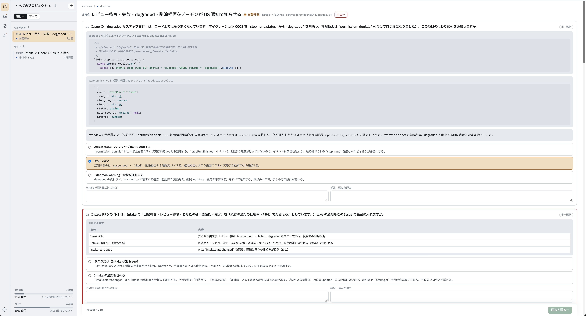

## Intake — PFD による分解

Epic 粒度の Issue を、レビューされた計画と、順に流れるタスクへ変える機能である（[Intake の PRD](https://github.com/todokr/doctrine/blob/develop/docs/prd/intake.md)）。Intake はタスクではなく、Issue が完了するまで — 数日から数週間 — 生き続ける別の種類の実体としてデーモンが持つ。

- **分解の前に論点をすべて返す。** エージェントは Issue とリポジトリを調べ、PFD を作るうえで論点になることを洗い出す。人の判断が要るものは質問、根拠から導けるものは結論と根拠の付いた仮定として、まとめて 1 回で届ける。質問には推奨を付けない。推奨は、人が選択肢を比べる前に答えを差し出し、熟慮を飛ばさせるからである
- **PFD で割る。** 要素は成果物とプロセスの 2 種類だけである。実行の順序はプロセスの並びとしては書かず、成果物の入出力から決まる。プロセスは、人が一度でレビューしきれる PR 1 つ、エージェントが 1 回でやりきれる、単独でマージして baseBranch が壊れない、出力が単独で検証できる、の 4 条件を満たすまで割る（[PFD による分解](https://github.com/todokr/doctrine/blob/develop/docs/superpowers/specs/2026-09-20-pfd-decomposition-design.md)）
- **PFD を図としてレビューする。** 成果物・プロセス・全体にコメントを付けて差し戻せる。承認は、そのとき表示されている PFD の内容に対して記録される。検証に通らない PFD は人に届かず、エージェントへ返って直される
- **sub-issue を作る。** 承認されると、プロセスごとに親 Issue の sub-issue を作る。PR は自分の sub-issue を閉じる
- **マージを見張って次を投入する。** デーモンが PR のマージを見張り、入力が揃ったプロセスを自動でタスクにする。アプリを閉じていても動く。同じプロセスが二重にタスクになることは、デーモンが途中で落ちても無い
- **改訂と再投入。** 進行中の計画を、未投入の部分に限って直して承認し直せる。止まったプロセスはビューから再投入できる

*回答待ちの Intake。質問ごとに、コード片や表といった判断材料が付く。選択肢に推奨は付かず、選択肢以外の答えと選んだ理由を書ける。*

*完了した Intake の PFD。上にプロセスの状態ごとの件数が並ぶ。図の要素を選ぶと、右にその定義（説明・確かめ方・前段と後続）が出る。下の経緯からは、過去の質問と回答を読み返せる。*

## ワークフローによるタスクの実行

タスクは、プロジェクト内に YAML で置いたワークフローに沿って進む。ワークフローは**ステップ**の並びで、ステップは次の 5 種類である。

| 種類         | すること                                                    |
| ---------- | ------------------------------------------------------- |
| `command`  | シェルのコマンドを実行する（テスト、lint、`git`、`gh` など）。再実行しても安全でなければならない |
| `agent`    | Claude Code に prompt を渡して作業させる。許す道具と、役割ごとの会話を指定する       |
| `approval` | 人の承認を待つ。差し戻しは指定したステップへ戻す                                |
| `guide`    | Review Guide を作らせる                                      |
| `poll`     | 外の状態が変わるまで待つ（PR のマージなど）。待っている間は実行枠を占有しない                |

ステップが失敗したり差し戻されたりしたときは、`goto` で指定したステップへ戻る。戻るたびの試行は**ステップ実行**として記録され、何回目の試行で何が起きたかを後から辿れる。ワークフローは、アプリの設定画面から図として確かめ、ステップを編集することもできる。

タスクごとに git worktree とブランチを 1 つずつ切り、リポジトリの外に置く。同時に走るタスクの数は**実行枠**で抑える。実行枠には全体とプロジェクト単位の 2 つがあり、デーモンは空いた枠を見てタスクを順に起動する。失敗や中止で止まったタスクの worktree は残り、人がそこから拾い直せる。

## Review Guide

Review Guide は doctrine が提供する価値の中核をなす重要な機能である。

この機能は、

1. エージェントが行った作業の理解を容易にするため、 hunk を読むべき順番に並び替えてグルーピングし、
2. 解説となるテキストと図を添え、
3. 人間がインラインあるいは全体に対してのフィードバックをコメントできる

というものである。

人間はグループごとの解説と hunk を上から下へ読み進めるだけで、変更の全体を理解できる。

*Review Guide に沿ったレビュー画面。左にガイドの順に並んだグループ、右にそのグループの解説と依存図、続いて hunk が並ぶ。図の中の追加・変更・削除は色で分かれる。*

コードの移動・コピー・改名は「削除と追加」ではなく**移動として**表示し、人間が読む量を実質的な変更だけに絞る。

読む単位は hunk である。ガイドは hunk を、doctrine が振った id（パスと hunk 本文から決まる）で指す。行番号では指さない。行番号は diff の並び替えや後続の変更で動くため、箇所を指す名前にならない。ファイルの新設やファイル単位の役割の変化のように hunk に落とせない話は、ファイル全体を指して紐づける。

解説においては、

- **Why** — 今回の実装が何を解決しているか
- **What** — 概念単位で何が変わったか
- **How** — 変更後のコードの構造（呼び出しの流れなど）
- **Key Decisions** — 重要な設計判断とその理由
- **Risks** — 壊しうるもの・置いた前提・分かっていないことを、事実として書く。読み手への指示は書かない。種類は **壊しうるもの / 置いた前提 / 分かっていないこと / 検討したが問題なかった点** の4つで、最後の種類は何が検討済みなのかを人間に伝える。該当する箇所（hunk id またはファイル全体）に紐づけ、項目からその箇所へ辿れるようにする。各項目には、悪い方に転んだときに起きることの大きさ（影響: 大・中・小）を付ける。影響は「どこを見るべきか」という指示の強さではなく、項目についての事実として付ける。指示として付けると人をその箇所だけに誘導し、AI だけのレビューと変わらなくなるため。どこから・どこまで読むかは人が決める。確信の度合いは種類（分かっていないこと／検討したが問題なかった点）が持つので、影響には混ぜない。検討したが問題なかった点にも、その判断が外れていたときの影響を付ける
- **Tests** — 意図した振る舞いをどのテストが示しているか

を提供する。

解説生成の入力には git diff だけではなく、**タスクのライフサイクル全体**（Issue、計画、計画レビューの結果、diff、AIによるセルフコードレビュー結果、テスト結果、リポジトリ構造）を用いる。

説明に際しては文章だけでなく、図を適切に用い、人間の理解を容易にすることが非常に重要である。

図は自由な描画ではなく、決まった種類の構造化データとして持つ。種類は **シーケンス図・関係図・依存／呼び出し図・状態遷移図** の4つである。アニメーションはデータに持たせない。画面が構造化データを受け取って描画するときに付ける。ガイドを作るエージェントは、何をどう動かすかを指定しない。

## マージ待ちと conflict の自動修復

PR を開いたことはタスクの終わりではない。マージされたときが終わりである。PR を開いた後も `poll` ステップでマージを待つワークフロー（[タスクから PR まで](/ja/concepts/usage/#タスクから-pr-まで)を参照）では、その間に baseBranch と conflict したら、同じ worktree・同じ会話で baseBranch を取り込んで直し、テストを通して push し直す（[マージ待ちの設計](https://github.com/todokr/doctrine/blob/develop/docs/superpowers/specs/2026-09-22-merge-wait-design.md)）。

取り込みは merge で行い、rebase はしない。自動で解いた conflict は人に見直させず、解いた記録を PR にコメントする。直しきれずに決められた回数を使い切ったら、タスクを失敗にせず人の判断を待つ。PR が閉じられたら、タスクは中止になる。

## 利用上限での待機

Claude の利用上限（5 時間枠・7 日枠）に当たると、エージェントの実行は途中で打ち切られる。doctrine はこれを失敗として扱わない。タスクを**上限待ち**にし、枠が明ける時刻が来たら、同じステップ・同じ会話から自動で再開する（[上限待ちの設計](https://github.com/todokr/doctrine/blob/develop/docs/superpowers/specs/2026-09-19-rate-limit-wait-design.md)）。

上限を失敗として扱えば、計画と実装を済ませた作業が、worktree・ブランチ・会話の続きごと捨てられる。待っている間は全体の実行枠を手放し、上限で待った回はステップの試行回数に数えない。Intake の調査・分解のエージェントも同じ規則で待つ。

## Issue トラッカー

Intake が Issue を取り込み、sub-issue を作る先は、プロジェクトごとに GitHub Issues か Linear のどちらかを選ぶ。どちらを使っても、PR は GitHub にあり、マージの検知は GitHub の PR を見て行う。
